# רשת חדרי כושר
מערכת בקרת כניסות ויציאות

**מגישים:**

- מעוז דניאל, 324291608  
- אסף קלר, 325443505  


## תוכן עניינים

- [שלב א: עיצוב ובניית בסיס הנתונים](#שלב-א-עיצוב-ובניית-בסיס-הנתונים)
  - [הקדמה](#הקדמה)
  - [עיצוב בסיס הנתונים](#עיצוב-בסיס-הנתונים)
  - [יצירת בסיס הנתונים ואכלוסו](#יצירת-בסיס-הנתונים-ואכלוסו)
  - [גיבוי](#גיבוי)
- [שלב ב: שאילתות](#שלב-ב-שאילתות)
  - [שאילתות SELECT](#שאילתות-לדוגמה-שאילתות-select)
  - [שאילתות עדכון (UPDATE)](#שאילתות-עדכון)
  - [שאילתות מחיקה (DELETE)](#שאילתות-מחיקה)
  - [אילוצים (Constraints)](#אילוצים-constraints)
  - [COMMIT – שמירת שינויים](#commit--שמירת-שינויים-בבסיס-הנתונים)
  - [ROLLBACK – ביטול שינויים](#rollback--ביטול-שינויים-בבסיס-הנתונים)
- [שלב ג: אינטגרציה ומבטים](#שלב-ג-אינטגרציה-ומבטים)
  - [אינטגרציה](#אינטגרציה)
  - [מבטים (Views)](#מבטים-views)
- [שלב ד: תכנות](#שלב-ד-תכנות)
  - [פונקציות](#פונקציות)
  - [פרוצדורות](#פרוצדורות)
  - [טריגרים](#טריגרים)


## שלב-א-עיצוב-ובניית-בסיס-הנתונים

## הקדמה
בסיס הנתונים של בקרת כניסות ויציאות בחדרי הכושר נועד לנהל ביעילות מידע הקשור למנויים, עובדים, מכשירי גישה, תיקונים, אזורים ומכוני כושר. המערכת מבטיחה ארגון מסודר ומעקב אחר נתונים חיוניים כמו רישומי כניסה ויציאה, חברות מנויים, תחזוקת ציוד ופרטי עובדים.

### מטרת בסיס הנתונים
בסיס הנתונים משמש פתרון מסודר ואמין לניהול הפעילות ברשת חדרי כושר, ומטרתו:

- לנהל מעקב אחרי כניסות ויציאות של מנויים ועובדים מאזורים שונים במכוני הכושר.
- לעקוב אחרי מצב המכשירים השונים, לדווח ולנהל תיקונים ותחזוקה.
- לשמור על נתוני מנויים, כולל סוג חברות, תוקף החברות ופרטים אישיים.
- לנהל אזורי גישה שונים בתוך מכוני הכושר ולהגדיר הרשאות כניסה אליהם.
- לשמור מידע על עובדים, כולל פרטי התקשרות, תאריכי העסקה ותפקידים.

### מקרי שימוש אפשריים
- **מנהלי חדרי כושר** יכולים לעקוב ולנהל מידע על מנויים, מכשירים, אזורי גישה ועובדים.
- **מנויים** יכולים לקבל מידע מעודכן על סוג החברות שלהם, תוקף החברות ופרטי ביקורם בחדר הכושר.
- **עובדי תחזוקה** יכולים לקבל גישה לרשימות מכשירים שדורשים תיקון, לדווח על תיקונים שבוצעו, ולקבל מידע אודות המכשירים באחריותם.
- **הנהלה וצוות העובדים** יכולים להשתמש במערכת לניהול המידע, תכנון וארגון העבודה בצורה יעילה ומסודרת.

בסיס הנתונים בנוי בצורה שמייעלת את פעילות רשת חדרי הכושר, תוך שמירה על סדר, שקיפות ותקשורת נוחה בין כל הגורמים המעורבים.

---

## עיצוב בסיס הנתונים

### ERD

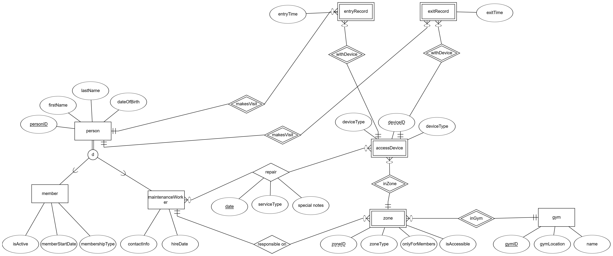


הסבר על התרשים:  קיימת לנו יישות בן-אדם, שממנו יורשות שתי ישויות: מנוי ועובד תחזוקה. כל עובד תחזוקה אחראי על אזור תיקון מסוים, ובנוסף יכול לתקן מכשיר גישה. עבור כל אדם שנכנס לאזור מסוים בחדר הכושר יש רשומת כניסה ורשומת יציאה. כל רשומת כניסה ויציאה היא ישות חלשה שתלויה באדם ובמכשיר גישה.  כל מכשיר גישה הוא ישות חלשה שתלויה באזור, וכל אזור הוא ישות חלשה שתלויה בחדר כושר מסוים
### DSD
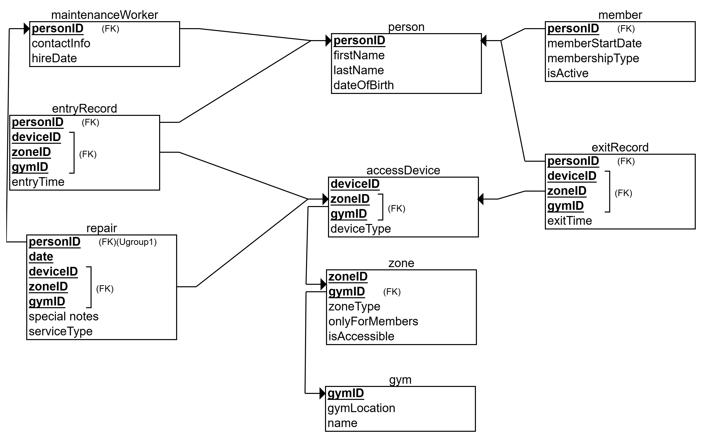

## יצירת בסיס הנתונים ואכלוסו

### יצירת בסיס הנתונים
- קובץ יצירת הטבלאות: [createTables.sql](Stage_A/scripts/createTables.sql)
- קובץ הכנסה לטבלאות: [insertTables.sql](Stage_A/scripts/insertTables.sql)
- קובץ מחיקת הטבלאות: [dropTables.sql](Stage_A/scripts/dropTables.sql)
- קובץ בחירת כל הטבלאות: [selectAll.sql](Stage_A/scripts/selectAll.sql)
  
### אכלוס הנתונים
אכלסנו את הנתונים ב־3 דרכים:

**1. Mockaroo**  
יצרנו את הנתונים בצורה רנדומלית באתר עבור הסכמה של חדר כושר והעלנו את הקובץ ישירות  

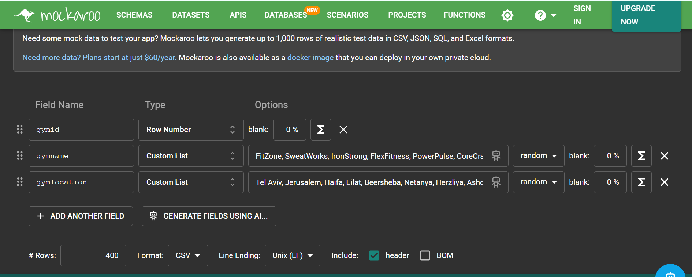

[📄 הורדת קובץ ה־CSV – gym_400.csv](Stage_A/data/mockaroo/gym_400.csv)

**2. הכנסת נתונים מקבצים**  
כתבנו קוד בפייתון שיוצר דאטה עבור הסכמות של אזורים, מכשירי גישה ותיקון, כך שהסכמה של מכשירי הגישה נבנת על נתונים מהסכמה של אזורים (מכיוון שהמפתח של אזור הוא מפתח זר למכשיר גישה). העברנו את הנתונים לקובץ CSV, ואותו העלינו ישירות ל־Postgres.  
- [קובץ CSV של מכשירי גישה (accessDevice)](Stage_A/data/csv/accessDevice/accessDevice.csv)
- [קובץ CSV של תיקונים (repair)](Stage_A/data/csv/repair/repair.csv)
- [קובץ CSV של אזורים (zone)](Stage_A/data/csv/zone/zone.csv)


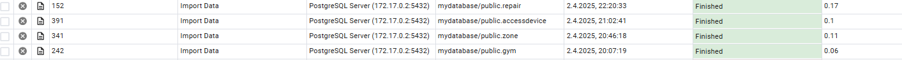


בנוסף, הכנסנו בצורה ידנית את פקודות ה־INSERT עבור מנויים, אנשים ועובדי תחזוקה.  
#### 🔗 קישורים לקבצים:
- [insert_member_400_from_800 (1).sql](Stage_A/data/insert%20commands/insert_member_400_from_800%20%281%29.sql)
- [insert_person_800.sql](Stage_A/data/insert%20commands/insert_person_800.sql)
- [insert_worker_400_from_800.sql](Stage_A/data/insert%20commands/insert_worker_400_from_800.sql)

**3. יצירת סקריפט בפייתון**  
יצרנו נתונים בעזרת סקריפט פייתון עבור רשומות הכניסה והיציאה, שמסתמך על נתונים ממכשירי גישה ואנשים (מכיוון שהמפתחות שלהם הם מפתחות זרים לרשומות). אותם העברנו לתוך קובץ CSV והעלינו אותם ישירות ל־Postgres מתוך הסקריפט.  
##### 🟢 רשומות כניסה (Entry Records)

- [entryRecord.csv](Stage_A/data/python%20scripts/entry_record/entryRecord.csv)  
- [insert_entry_record.py](Stage_A/data/python%20scripts/entry_record/insert_entry_record.py)

##### 🔴 רשומות יציאה (Exit Records)

- [exitRecord.csv](Stage_A/data/python%20scripts/exit_record/exitRecord.csv)  
- [insert_exit_record.py](Stage_A/data/python%20scripts/exit_record/insert_exit_record.py)
  
הערה: מכיוון שבבסיס הנתונים שלנו ישויות נבנות אחת על השנייה, יצרנו קודם כל את הנתונים של gym, שלא תלוי באף אחד, לאחר מכן של person, worker ו-member, ולאחר מכן את של zone, accessdevice, entry/exit record. גם את הנתונים עצמם ביססנו מישות חזקה ליישות החלשה שנתמכת בה, כך שהערכים בבסיס הנתונים יהיו הגיוניים ותואמים לעולם האמיתי
## גיבוי
קובץ הגיבוי נשמר עם תאריך הגיבוי 


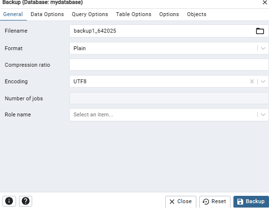  
[ הורדת קובץ הגיבוי (backup1_642025)](Stage_A/backup/backup1_642025)

---

##### 🔁 פעולת שחזור:

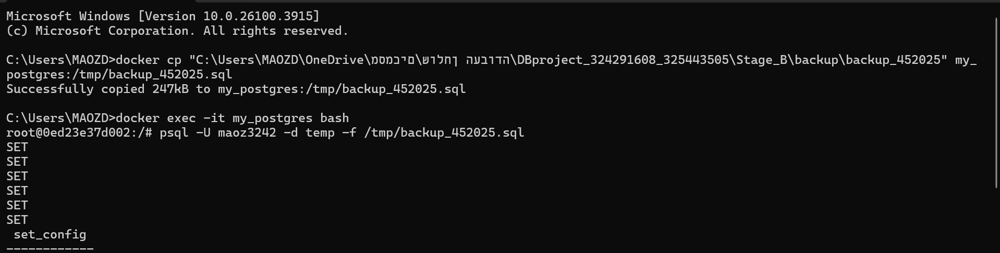

## שלב ב: שאילתות

בשלב זה ביצענו שאילתות שונות על בסיס הנתונים שבנינו בשלב א'. המטרה הייתה להוציא נתונים משמעותיים לצורכי ניתוח, תחזוקה וניהול חכם של רשת חדרי הכושר.

---

### שאילתות לדוגמה: שאילתות SELECT

להלן מספר שאילתות שבוצעו, יחד עם תיאור מטרתן, הקובץ שבו הן כתובות, ותמונה שמציגה את הפלט או את התוצאה הוויזואלית של שאילתא.

---

####  שאילתה 1: סיכום כמות כניסות ואזורים לפי חדר כושר

-  קובץ השאילתא: [query_1.sql](Stage_B/Queries/query_1/query_1.sql)  
- תוצאת השאילתא:  
  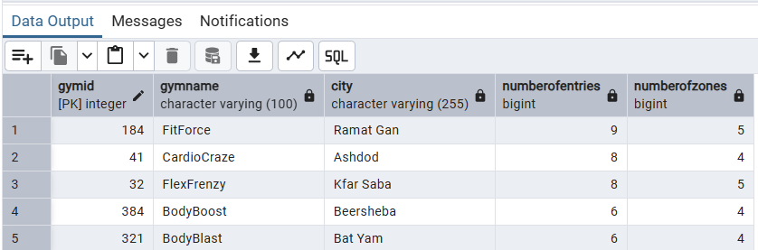

**מה השאילתא מחזירה:**  
את מזהה חדר הכושר, שמו, העיר שבה הוא נמצא, מספר הכניסות הכולל שנרשמו אליו, ומספר האזורים הקיימים בו – רק עבור חדרי כושר עם יותר משלושה אזורים, וממויין לפי כמות הכניסות בסדר יורד.

**המטרה:**  
לאפשר השוואה בין חדרי כושר שונים מבחינת עומס משתמשים מול מבנה פנימי, לצורך תובנות ניהוליות ושיפור תשתיות.

---

####  שאילתא 2: חברים פעילים שלא נכנסו מאז תאריך מסוים

-  קובץ השאילתא: [query_2.sql](Stage_B/Queries/query_2/query_2.sql)  
-  תוצאת השאילתא:  
  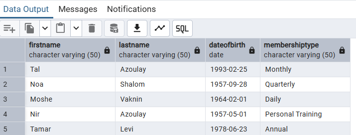

**מה השאילתא מחזירה:**  
את שם הפרטי, שם המשפחה, תאריך הלידה וסוג החברות של כל המנויים הפעילים, אשר לא נכנסו לאף חדר כושר מאז ה־3 בינואר 2025

**הרעיון :**  
לזהות מנויים פעילים שלא ביקרו בחדר כושר מאז תאריך מסוים, לצורך מעקב או פנייה יזומה מצד ההנהלה.

---

####  שאילתא 3: סיכום כניסות לפי חדר כושר ולפי חודש (בשנת 2025)

-  קובץ השאילתא: [query_3.sql](Stage_B/Queries/query_3/query_3.sql)  
-  תוצאת השאילתא:  
  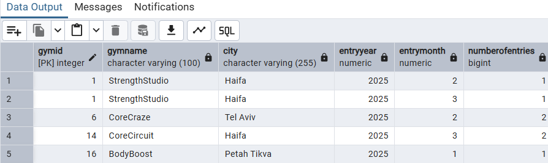

**מה השאילתא מחזירה:**  
את מזהה חדר הכושר, שמו, העיר שבה הוא נמצא, השנה והחודש של הכניסה, וכמות הכניסות באותו חודש – עבור כל חודש בשנת 2025. התוצאות מקובצות לפי חדר כושר וחודש, וממוינות לפי מזהה חדש הכושר והשנה-חודש.

**הרעיון :**  
לבחון את כמות הביקורים בכל חדר כושר לאורך חודשי השנה לצורך מעקב עונתי וניתוח מגמות.

---

####  שאילתא 4: זמן שהייה ממוצע לפי אזור בחדר כושר מס' 184

-  קובץ השאילתא: [query_4.sql](Stage_B/Queries/query_4/query_4.sql)  
-  תוצאת השאילתא:  
  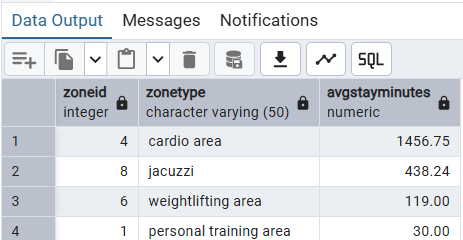

**מה השאילתא מחזירה:**  
את מזהה האזור, סוג האזור, וזמן השהייה הממוצע בו  בחדר כושר מספר 184. התוצאה ממוינת מהאזור בו שוהים הכי הרבה ועד לפחות.

**הרעיון :**  
לזהות אילו אזורים בחדר הכושר מושכים מתאמנים לזמן ארוך יותר, לצורך תכנון תפעולי נכון או תגבור ציוד.


---

####  שאילתא 5: חדרי כושר עם יותר מ־5 תיקונים

-  קובץ השאילתא: [query_5.sql](Stage_B/Queries/query_5/query_5.sql)  
-  תוצאת השאילתא:  
  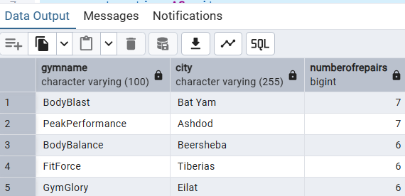

**מה השאילתא מחזירה:**  
את שם חדר הכושר, העיר שבה הוא נמצא, ומספר התיקונים שבוצעו בו – רק עבור חדרי כושר שבהם בוצעו יותר מ־5 תיקונים. התוצאה ממוינת מהחדר עם הכי הרבה תיקונים לפחות.

**הרעיון :**  
לאתר חדרי כושר עם עומס תחזוקתי גבוה לצורך בדיקה, טיפול מונע או תגבור צוותי תחזוקה.

---

####  שאילתא 6: חדרי כושר עם לפחות 2 אזורים לא נגישים ויותר מ־2 כניסות

-  קובץ השאילתא: [query_6.sql](Stage_B/Queries/query_6/query_6.sql)  
-  תוצאת השאילתא:  
  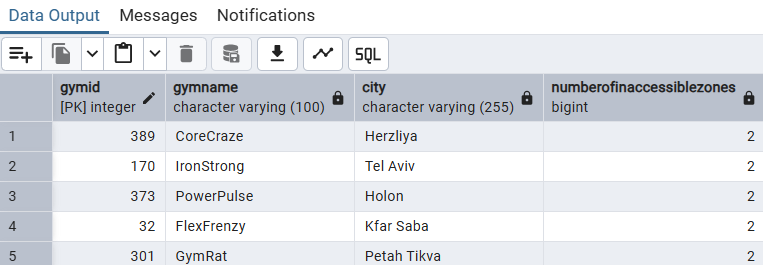

**מה השאילתא מחזירה:**  
את מזהה חדר הכושר, שמו והעיר שבה הוא נמצא – רק  עבור חדרי כושר שבהם קיימים לפחות שני אזורים לא נגישים וגם נרשמו יותר מ2 כניסות

**הרעיון :**  
לאתר חדרי כושר שמצד אחד פעילים, אך מצד שני כוללים אזורים לא נגישים – כדי לשקול תיקונים או פתיחה מחודשת של אזורים.

---

####  שאילתא 7: כניסות ויציאות מאזורים עמוסים במיוחד

-  קובץ השאילתא: [query_7.sql](Stage_B/Queries/query_7/query_7.sql)  
-  תוצאת השאילתא:  
  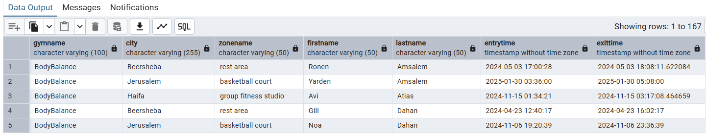

**מה השאילתא מחזירה:**  
את שם חדר הכושר, העיר, סוג האזור, שם פרטי ושם משפחה של האדם, זמן הכניסה וזמן היציאה – עבור אזורים שבהם נרשמו יותר מ־80 כניסות בסך הכול.

**הרעיון שלה:**  
להציג פעילות מפורטת של אנשים באזורים בעלי עומס גבוה במיוחד, לצורך ניתוח עומסים או תכנון תשתיות עתידי.

---

####  שאילתא 8: סוגי מכשירים עם פחות יציאות מהממוצע

-  קובץ השאילתא: [query_8.sql](Stage_B/Queries/query_8/query_8.sql)  
-  תוצאת השאילתא:  
  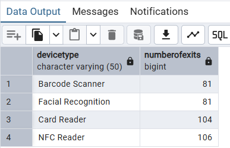

**מה השאילתא מחזירה:**  
את סוג המכשיר ומספר היציאות שבוצעו דרכו – רק עבור סוגי מכשירים שבהם מספר היציאות קטן מהממוצע הכללי בין כל סוגי המכשירים.

**הרעיון שלה:**  
לאתר מכשירי גישה פחות פעילים מהממוצע, לצורך בדיקה תפעולית או הסרה עתידית של ציוד לא נחוץ.


---

## שאילתות עדכון

בקטע זה נציג שאילתות מסוג UPDATE שבוצעו על בסיס הנתונים, יחד עם הסבר, צילום לפני השינוי, צילום ההרצה, וצילום מצב הנתונים לאחר השינוי.

---

####  שאילתא 1: עדכון סוג החברות למנויים פעילים במיוחד

-  קובץ השאילתא: [update_1.sql](Stage_B/Updates/update_1/update_1.sql)  
-  צילום לפני העדכון:  
  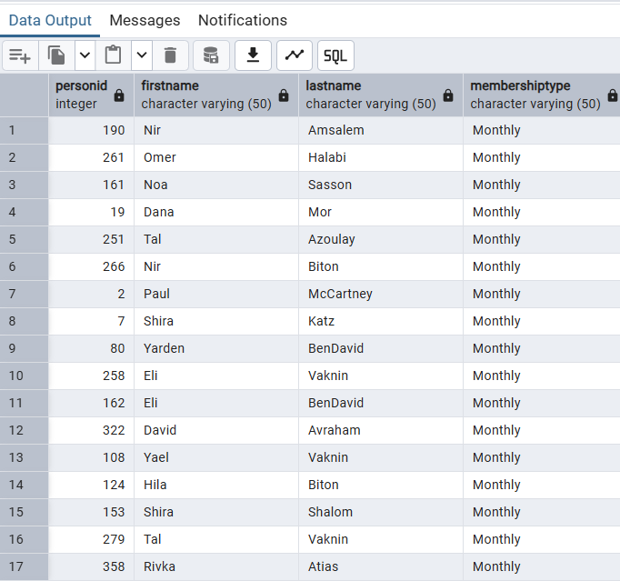
-  צילום הרצת העדכון:  
  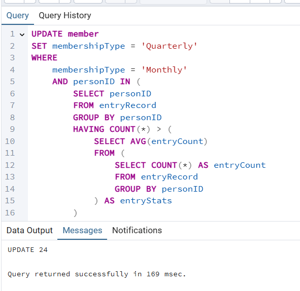
-  צילום לאחר העדכון:  
  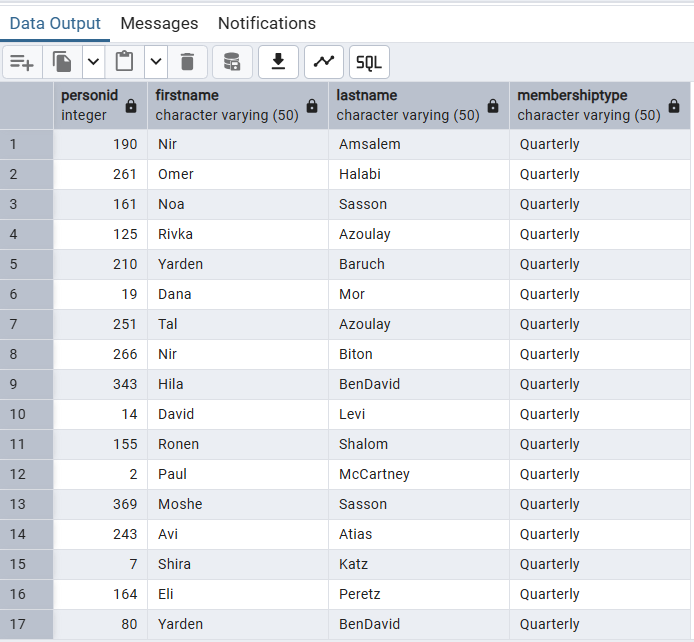

**מה השאילתא עושה:**  
מעדכנת את סוג החברות של מנויים שמוגדרים כ־"Monthly" ל־"Quarterly", רק אם הם נכנסו לחדרי כושר יותר מהממוצע הכללי של מספר הכניסות.

**הרעיון שלה:**  
לשדרג אוטומטית את סוג החברות למשתמשים פעילים במיוחד – כהוקרה, שיפור שירות או תמריץ.


####  שאילתא 2: סימון מנויים לא פעילים שלא נכנסו מעולם כ־'Expired'

-  קובץ השאילתא: [update_2.sql](Stage_B/Updates/update_2/update_2.sql)  
-  צילום לפני העדכון:  
  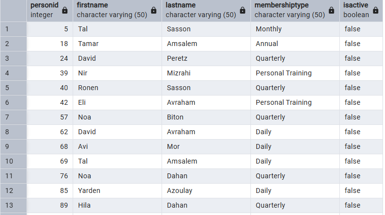
-  צילום הרצת העדכון:  
  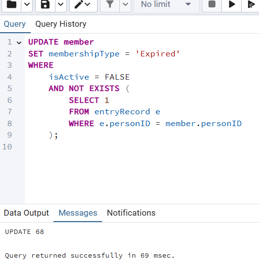
-  צילום לאחר העדכון:  
  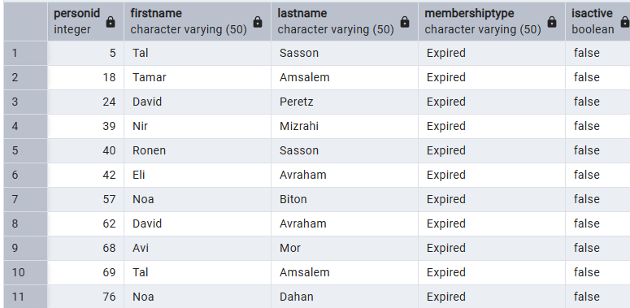

**מה השאילתא עושה:**  
מעדכנת את סוג החברות של כל המנויים שאינם פעילים (`isActive = FALSE`) ושמעולם לא נכנסו לחדר כושר (כלומר, אין להם רשומת כניסה) – ל־'Expired'.

**הרעיון שלה:**  
לסמן מנויים ישנים ולא פעילים ככאלה שתוקף המנוי שלהם פג, לצורך ניקוי מידע ותחזוקת נתונים.


---

####  שאילתא 3: השבתת מנויים שלא הגיעו לאחרונה

-  קובץ השאילתא: [update_3.sql](Stage_B/Updates/update_3/update_3.sql)  
-  צילום לפני העדכון:  
  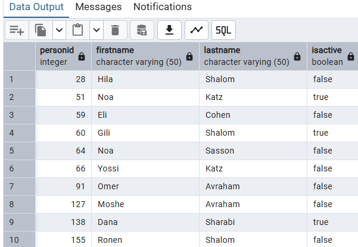
-  צילום הרצת העדכון:  
  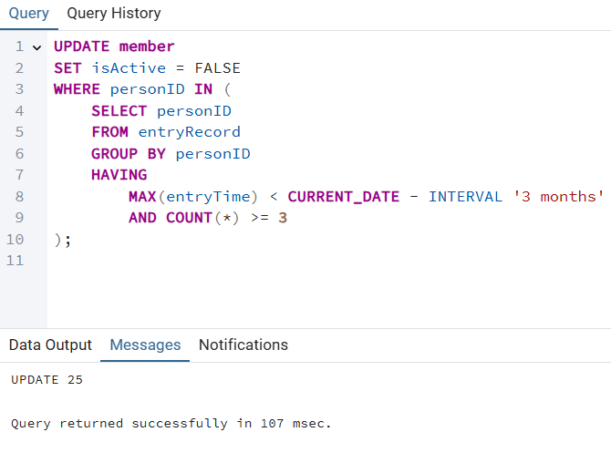
-  צילום לאחר העדכון:  
  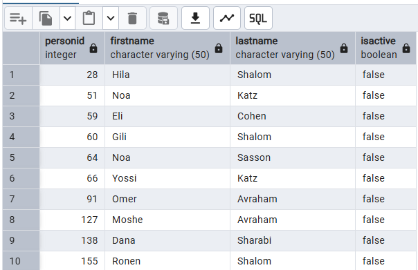

**מה השאילתא עושה:**  
מעדכנת את שדה `isActive` ל־FALSE עבור מנויים שביצעו לפחות 3 כניסות, אך הפעם האחרונה שבה נכנסו הייתה לפני יותר משלושה חודשים.

**הרעיון שלה:**  
להשבית מנויים שהיו פעילים בעבר אך לא הגיעו זמן רב, לצורך ניהול מדויק של סטטוס החברות.

---

## שאילתות מחיקה

בקטע זה מוצגות שאילתות מחיקה (`DELETE`) שבוצעו על בסיס הנתונים, כולל הסבר ברור, צילום מצב לפני המחיקה, צילום ההרצה, וצילום לאחר המחיקה — להמחשת השינוי בפועל.

---

####  שאילתא 1: מחיקת חדרי כושר קטנים בערים מסוימות

-  קובץ השאילתא: [delete_1.sql](Stage_B/Delete/delete_1/delete_1.sql)  
-  צילום לפני המחיקה:  
  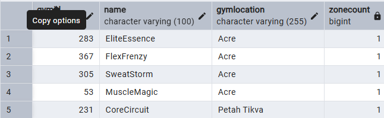
-  צילום הרצת המחיקה:  
  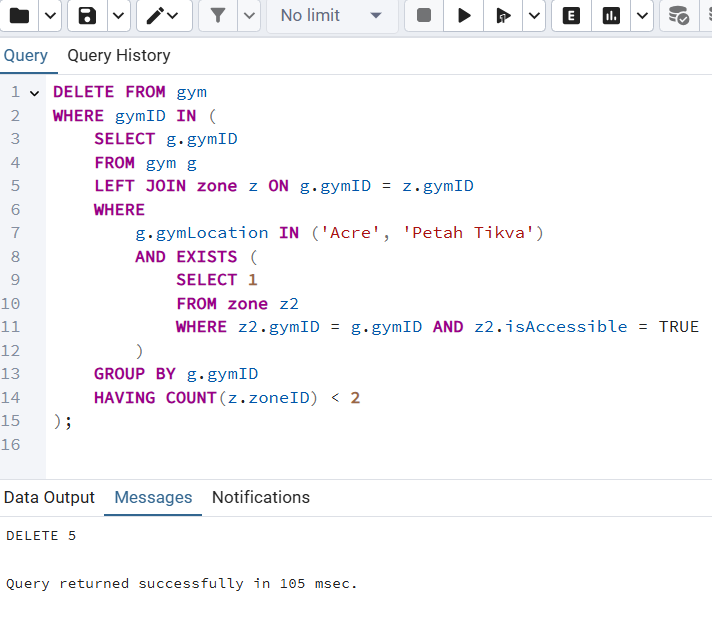
-  צילום לאחר המחיקה:  
  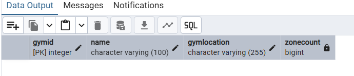

**מה השאילתא עושה:**  
מוחקת חדרי כושר שנמצאים בעכו או פתח תקווה, שיש להם פחות מ־2 אזורים, **ובלבד שיש להם לפחות אזור נגיש אחד** (`isAccessible = TRUE`).

**הרעיון שלה:**  
לנקות מהרשת חדרי כושר קטנים עם פעילות חלקית בלבד, במטרה לשמר רק סניפים מרכזיים ופעילים.

---

####  שאילתא 2: מחיקת מנויים צעירים שאינם פעילים ולא נכנסו מעולם

-  קובץ השאילתא: [delete_2.sql](Stage_B/Delete/delete_2/delete_2.sql)  
-  צילום לפני המחיקה:  
  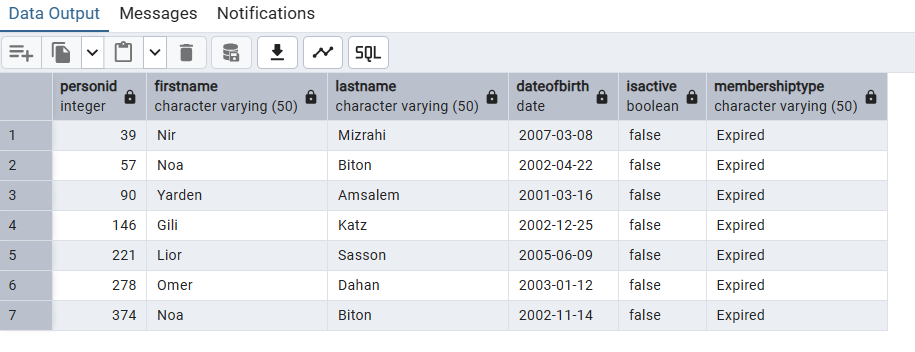
-  צילום הרצת המחיקה:  
  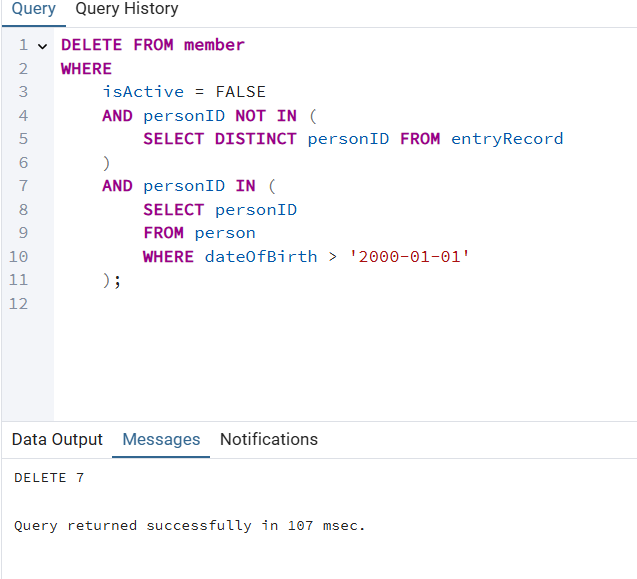
-  צילום לאחר המחיקה:  
  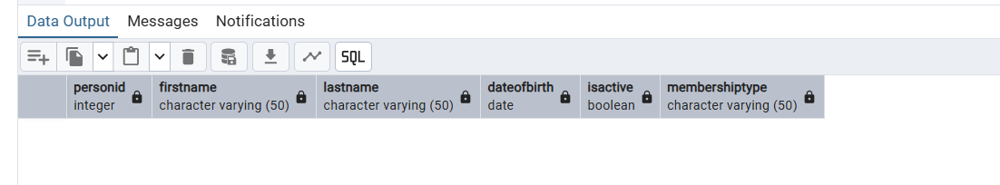

**מה השאילתא עושה:**  
מוחקת מנויים לא פעילים (`isActive = FALSE`) שמעולם לא נכנסו לחדר כושר (כלומר אין להם רשומות כניסה), ושנולדו לאחר 1 בינואר 2000.

**הרעיון שלה:**  
לצמצם את בסיס הנתונים ממנויים צעירים שלא התחילו להשתמש בשירות, כחלק מתחזוקת מידע וניקוי משתמשים.


####  שאילתא 3: מחיקת תיקונים ישנים מסוג Replacement

-  קובץ השאילתא: [delete_3.sql](Stage_B/Delete/delete_3/delete_3.sql)  
-  צילום לפני המחיקה:  
  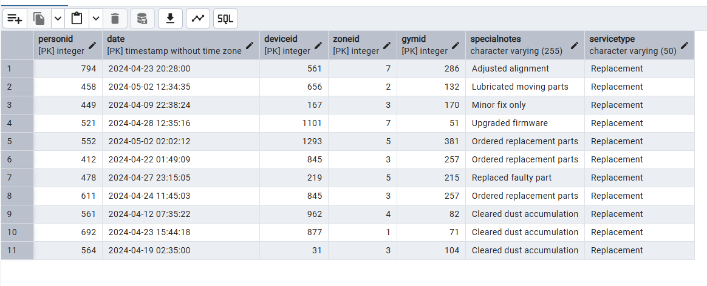
-  צילום הרצת המחיקה:  
  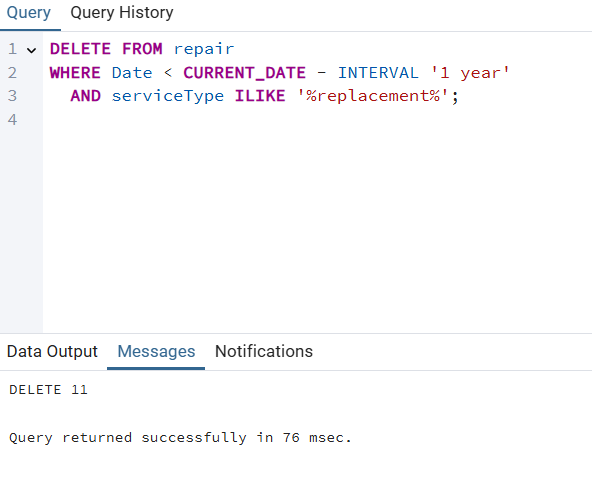
-  צילום לאחר המחיקה:  
  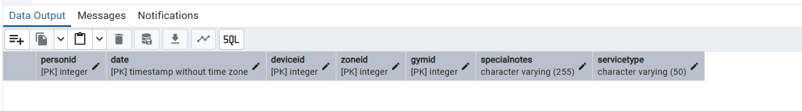

**מה השאילתא עושה:**  
מוחקת רשומות תיקון מהטבלה `repair` שבוצעו לפני יותר משנה, ושסוג השירות (`serviceType`) שלהן מכיל את המילה "replacement".

**הרעיון שלה:**  
לנקות תיקונים ישנים הקשורים להחלפות, כחלק מתחזוקת מערכת שוטפת והפחתת עומס על נתוני עבר.


##  אילוצים (Constraints)

בשלב זה הוספנו מספר אילוצים לשלוש טבלאות במערכת, באמצעות הפקודה `ALTER TABLE`.  
לאחר כל הוספה ניסינו להכניס נתונים שסותרים את האילוץ, כדי לוודא שהמערכת חוסמת את הפעולה כנדרש.


###  אילוץ 1: אימות שדה `contactInfo` בטבלת `maintenanceWorker`
האילוץ מוודא שערך השדה `contactInfo` הוא כתובת מייל חוקית או מספר טלפון חוקי בפורמט בינלאומי.  
אם הערך אינו תואם לאחד מהפורמטים הללו, ההכנסה תיחסם.

**תיאור שגיאה:**  
לאחר הוספת האילוץ, ניסינו להזין ערך שאינו כתובת מייל תקינה ואינו מספר טלפון חוקי (לדוגמה: מחרוזת בעברית).  
המערכת חסמה את ההכנסה וזרקה שגיאת `CHECK CONSTRAINT` כפי שצפוי.

-  צילום לנסיון הכנסה:  
  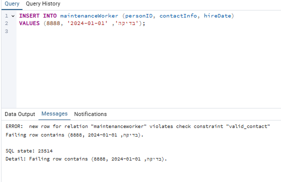


###  אילוץ 2: אימות ערכים חוקיים בשדות `membershipType` ו־`entryTime`
האילוץ הראשון בודק שהשדה `membershipType` כולל רק אחד מהערכים המותרים ('Monthly', 'Annual' וכו').  
האילוץ השני מוודא שערך השדה `entryTime` לא יהיה תאריך עתידי.

**תיאור שגיאה:**  
לאחר הוספת האילוצים, ניסינו להזין ערכים לא חוקיים – כגון `membershipType` שלא קיים ברשימת הסוגים המותרים , או `entryTime`  
המערכת חסמה את ההכנסות וזרקה שגיאת `CHECK CONSTRAINT`.

-  צילום לנסיון הכנסה:  
  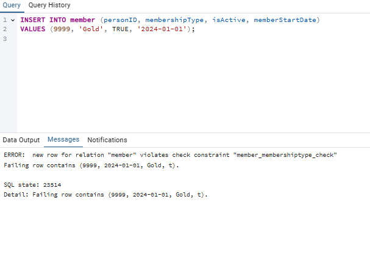

### אילוץ 3: הגבלת ערך שדה `dateOfBirth` בטבלת `person` לתאריכים שאינם בעתיד
האילוץ מונע הזנת ערך בשדה `dateOfBirth` שהוא תאריך מאוחר מהתאריך הנוכחי (`CURRENT_DATE`).

**תיאור שגיאה:**  
לאחר הוספת האילוץ, ניסינו להזין ערך לשדה `dateOfBirth` בטבלת `person` שהוא תאריך מהעתיד.  
המערכת זיהתה שהערך אינו עומד בתנאי האילוץ וזרקה שגיאת `CHECK CONSTRAINT`.

-  צילום לנסיון הכנסה:  
  


## COMMIT – שמירת שינויים בבסיס הנתונים
להלן הדגמה של תהליך ביצוע עדכון ושמירתו:

- הצגת הנתון המקורי:

   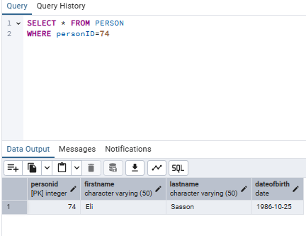

-  על רשומה מסוימת בטבלת `person`:

   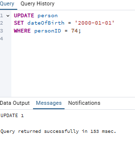

- הצגת נתונים לאחר ה־UPDATE ולפני ה־COMMIT (עדיין ניתן לבטל):

   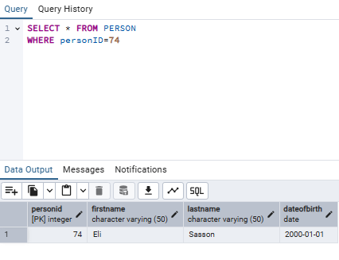

- הרצת פקודת `COMMIT` – שמירת השינוי באופן קבוע:

   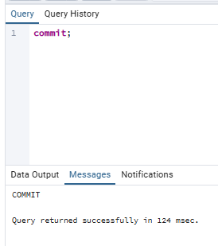

- מצב בסיס הנתונים לאחר ה־COMMIT – השינוי נשמר ואינו ניתן לביטול:

   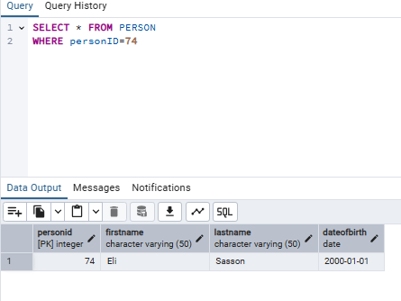


## ROLLBACK – ביטול שינויים בבסיס הנתונים

להלן הדגמה של תהליך הוספת רשומה חדשה וביטולה:

- מצב בסיס הנתונים לפני ההוספה:  
  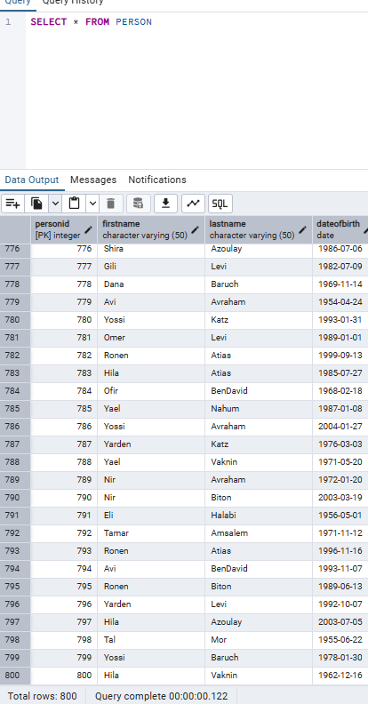

- ביצוע `INSERT` של אדם חדש לטבלת `person`:  
  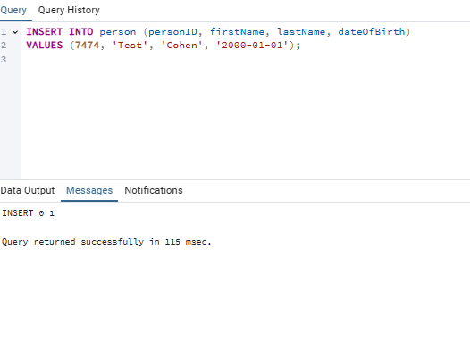

- הצגת הנתון החדש לאחר ההוספה (לפני `COMMIT`):  
  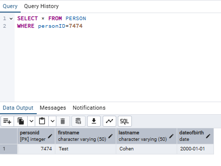

- ביצוע `ROLLBACK` – ביטול ההוספה:  
  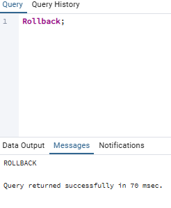

- מצב בסיס הנתונים לאחר ה־ROLLBACK – הרשומה בוטלה ולא נשמרה:  
  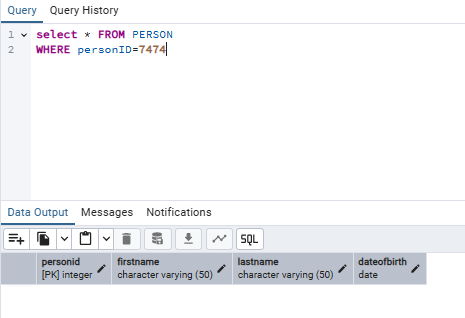

## שלב ג: אינטגרציה ומבטים

### אינטגרציה

ביצענו אינטגרציה עם **מחלקת ניהול וארגון ציוד חדר כושר**

#### התרשימים של המחלקה:

- ERD תרשים:
  
  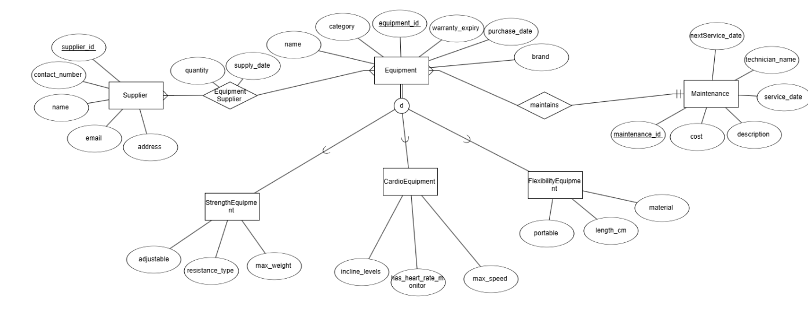

- DSD תרשים:
  
  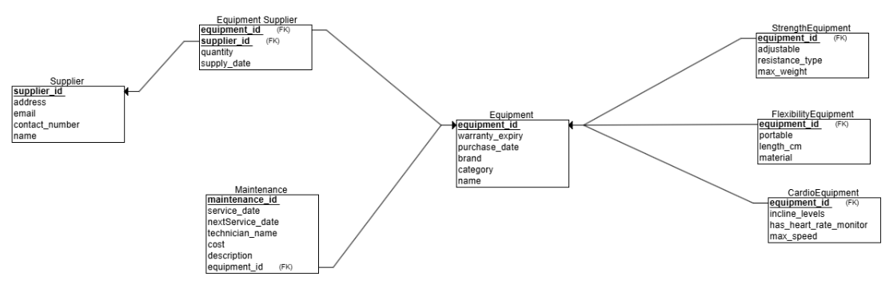

#### לאחר אינטגרציה עם המחלקה שלנו:

- ERD לאחר אינטגרציה:
  
  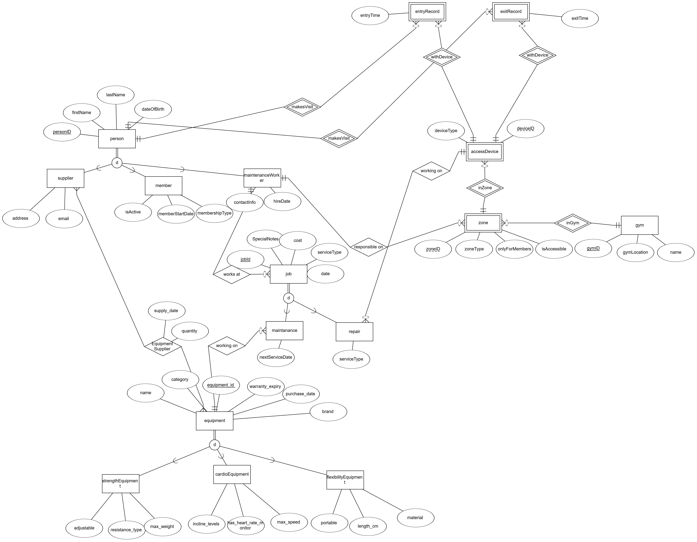

- DSD לאחר אינטגרציה:
  
  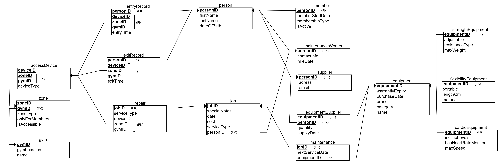

#### החלטות בשלב האינטגרציה:

- ישות `supplier` היא סוג של `person`, ולכן העברנו אותה להיות יורשת ממנו.
- החלטנו להוריד את השדות `contactNumber`, לפצל את השדה `name` לשדות `firstName` ו־`lastName` (כפי שהם בטבלת `person`), ולוותר על `supplierID` – עכשיו המפתח של כל ספק הוא `personID`.
- בעבר היו ישות `maintenance` ויחס `repair`, מכיוון ששתיהן מייצגות סוגים של עבודות – יצרנו ישות חדשה בשם `job`.
- הפכנו את היחס `repair` לישות עצמאית – `repair`, שכעת יורשת מהישות `job`, כמו גם `maintenance`.
- המפתח של `repair` עכשיו הוא `jobID`, ולא השלישייה שהייתה בשימוש קודם.
- איחדנו לתוך `job` את השדות המשותפים שהופיעו ביישויות הקודמות: `date`, `cost`, ו־`specialNotes`. שדה `cost` הועבר ל־`job`,כך שבעתיד נוכל להוסיף מחיר גם לתיקון `cost`.

### Supplier יורש מ־Person

---

- 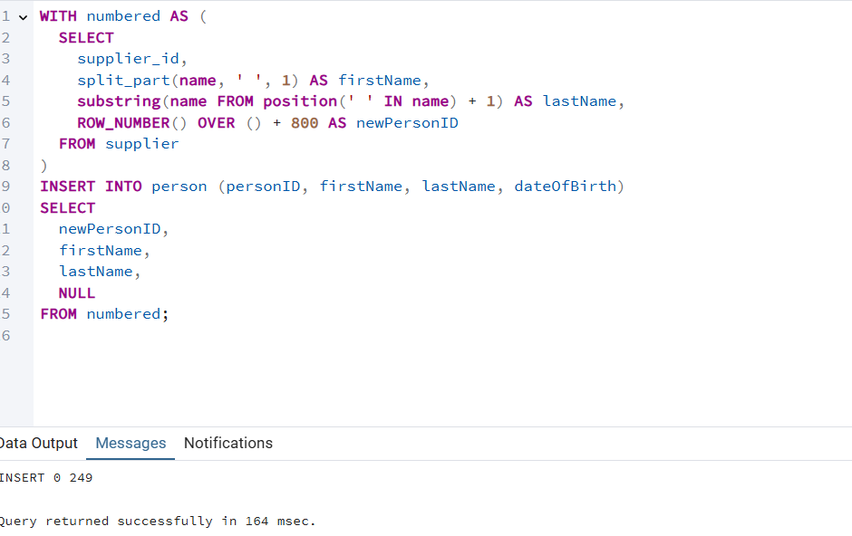

**הסבר:**  
חילקנו את השדה `name` לשדות `firstName` ו־`lastName`. יצרנו מזהה חדש `newPersonID` – מספר רץ שמתחיל מ־800, מכיוון שהמפתחות בטבלת `person` נגמרו ב־800. הוספנו את כל הספקים לטבלת `person`, תוך השמת ערך `NULL` בשדה `dateOfBirth`.
  


---

- 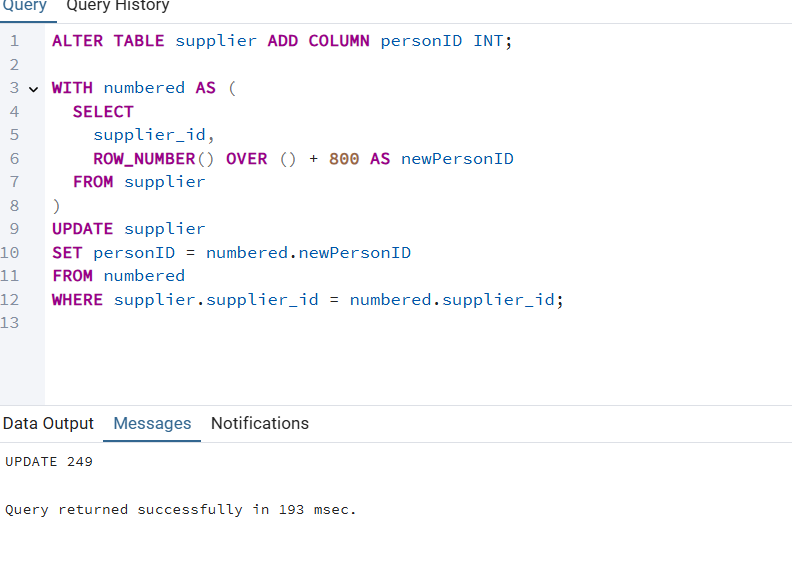

**הסבר:**  
הוספנו לטבלת `supplier` עמודה חדשה בשם `personID`, ועידכנו אותה כך שתתאים לערכים שנוספו בטבלת `person` בשלב הקודם.
  

---

- 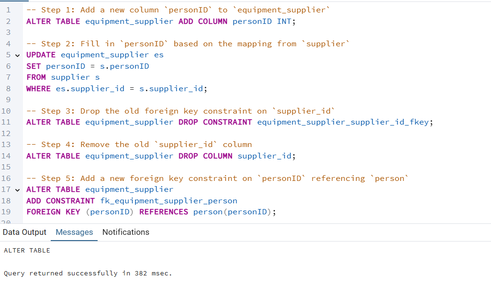

**הסבר:**  
מכיוון שטבלת `equipment_supplier` קשורה ל־`supplier`, יש לוודא שהיא מצביעה כעת על `personID` החדש — שהוא המפתח החדש של `supplier`.
  

---

- 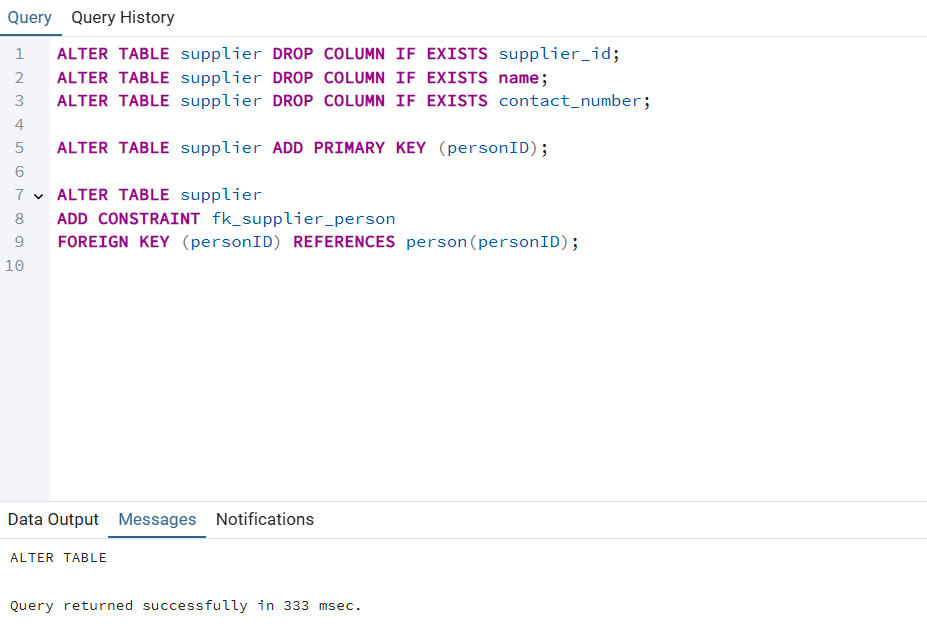

**הסבר:**  
הטבלה כללה את השדות `(supplier_id, name, contact_number)`.הגדרנו את `personID` כ־PRIMARY KEY של `supplier`, ויצרנו FOREIGN KEY אל הטבלה `person`, כדי להשלים את המעבר מ־`supplier` כיישות עצמאית לישות יורשת של `person`.  

## יצירת ישות Job והגדרת תתי-ישויות

---

- 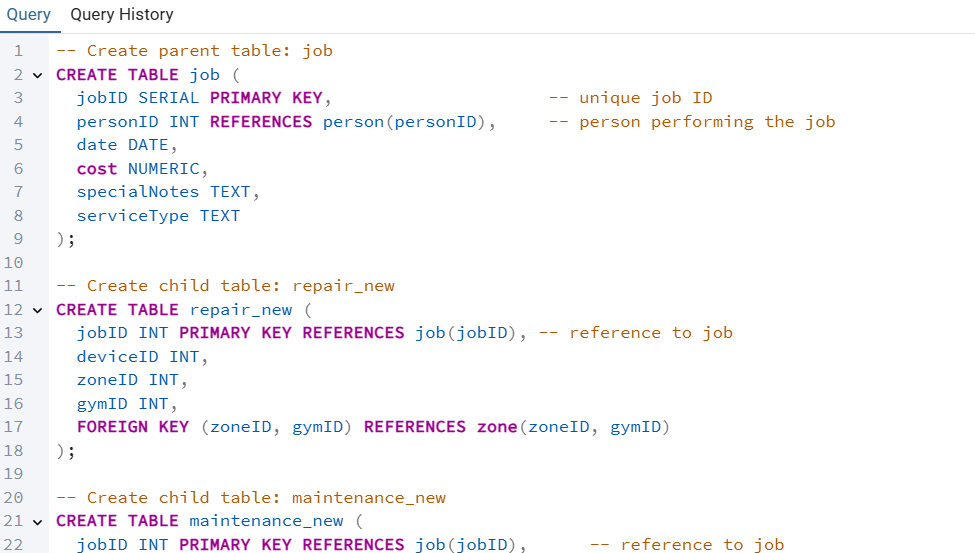

**הסבר:**  
יצרנו ישות `job` שמרכזת את המידע הכללי על פעולת תיקון או תחזוקה,  
ואת הטבלאות `repair_new` ו־`maintenance_new` עם מפתחות זרים המצביעים אליה.

---

- 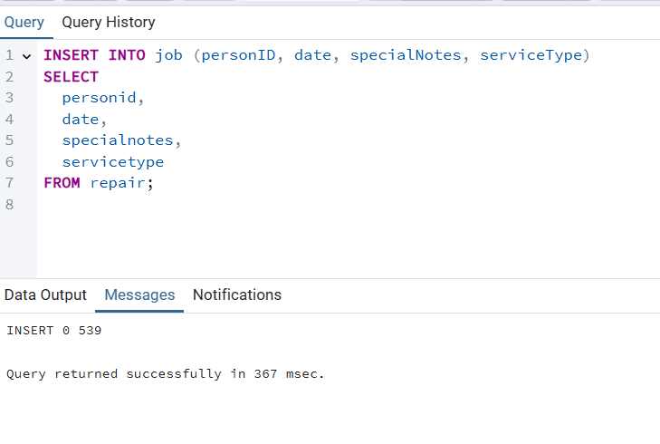

**הסבר:**  
הכנסנו את הנתונים הקיימים בטבלת `repair` (שכבר קיימת) אל הטבלה החדשה `job`,  
כדי שכל פעולה שמופיעה כ־`repair` תוכל להתקשר ל־`jobID`.

---

- 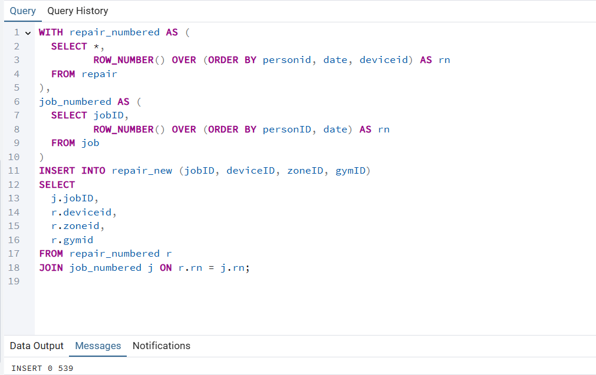

**הסבר:**  
התאמנו בין השורות של `repair` ל־`job` לפי `ROW_NUMBER`,  
והכנסנו לטבלה `repair_new`, מכיוון שאין מפתח טבעי ייחודי,  
ואין באמת משמעות למספר `job` כל עוד שומרים על יחס נכון.

---

- 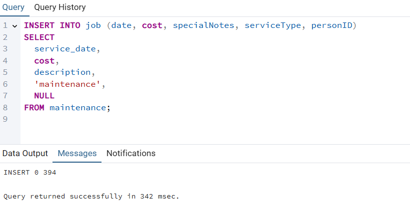

**הסבר:**  
שמרנו ב־`job` את המידע הכללי עבור כל רשומה בטבלת `maintenance`.

---

- 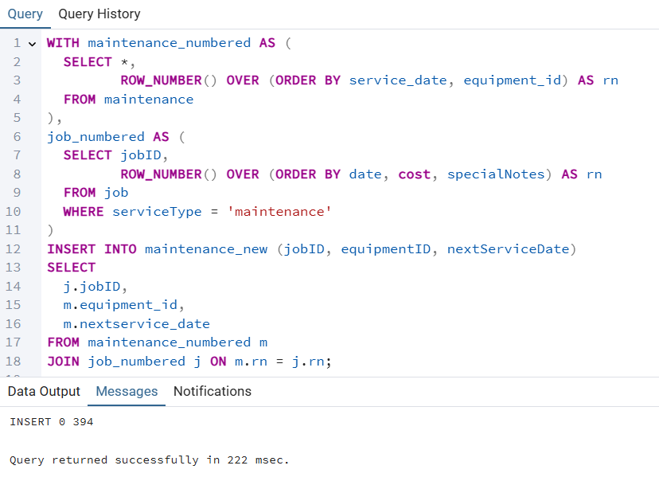

**הסבר:**  
כמו בשלב של `repair`, יצרנו התאמה בין רשומות `maintenance` לבין רשומות `job`  
תוך שימוש ב־`ROW_NUMBER`, והכנסנו לטבלה `maintenance_new`.

---

- 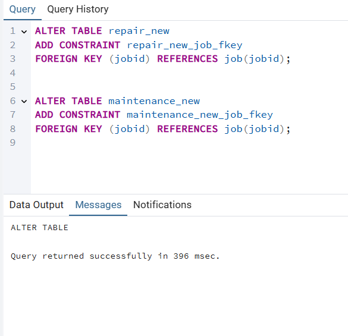

**הסבר:**  
קבענו שמפתח ראשי ב־`repair_new` וב־`maintenance_new` חייב להתקשר לרשומה חוקית בטבלת `job`.

---

- 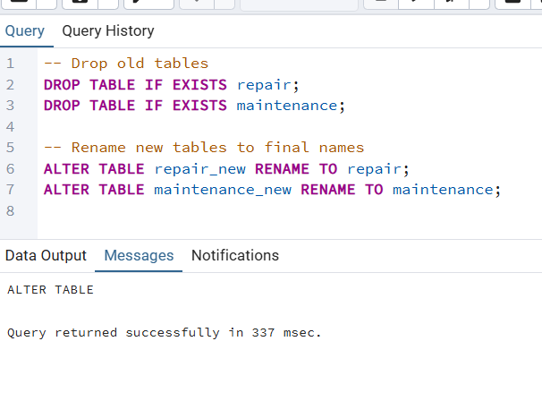

**הסבר:**  
מחקנו את הטבלאות הישנות `repair` ו־`maintenance`,  
ושינינו את שמות החדשות כך שישתלבו במערכת בדיוק כפי שהיו קודם.

---

- 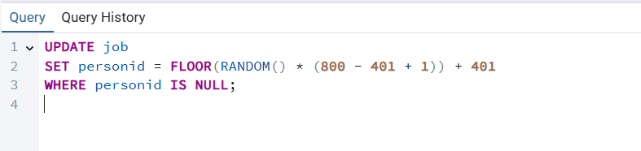

**הסבר:**  
עכשיו חילקנו את העבודות שהן `maintenance` ל־`maintenanceWorkers` אקראיים,  
מכיוון שבבסיס הנתונים הקודם הן לא היו משויכות ישירות לעובד.

## מבטים (Views)


###  View 1: Zone_Visit_Stats

מבט זה מציג עבור כל אזור במכון הכושר את מספר הכניסות אליו, יחד עם שם חדר הכושר וסוג האזור.  

####  יצירת המבט:

```sql
CREATE VIEW Zone_Visit_Stats AS
SELECT 
    z.zoneID,
    z.zoneType,
    g.name AS gymName,
    COUNT(er.personID) AS entryCount
FROM zone z
JOIN gym g ON z.gymID = g.gymID
LEFT JOIN entryRecord er ON z.zoneID = er.zoneID AND z.gymID = er.gymID
GROUP BY z.zoneID, z.zoneType, g.name;
```

####  המבט לאחר יצירתו
- 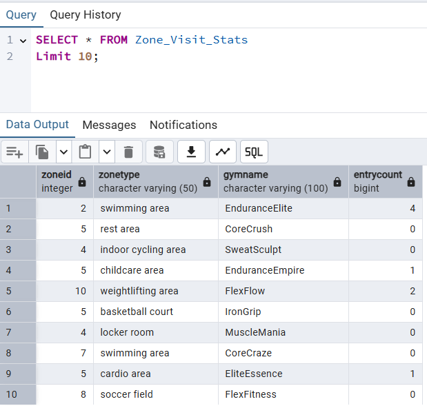

#### שאילתה 1: אזורים עם יותר משתי כניסות


```sql
SELECT * 
FROM Zone_Visit_Stats
WHERE entryCount > 2;
```
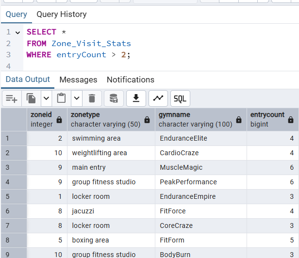

#### שאילתה 2: מספר אזורים לפי סוג אזור
```sql
SELECT zoneType, COUNT(*) AS numZones
FROM Zone_Visit_Stats
GROUP BY zoneType;
```
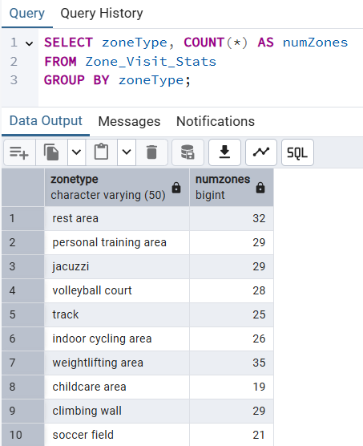

### View 2: Equipment_Supply_Info

מבט זה מציג מידע על ציוד שסופק למכון הכושר, כולל קטגוריית הציוד, כמות שסופקה, תאריך האספקה, וכן פרטי יצירת קשר של הספק שסיפק את הציוד.  


####  יצירת המבט:

```sql
CREATE VIEW Equipment_Supply_Info AS
SELECT 
    e.equipment_id,
    e.name AS equipment_name,
    e.category,
    s.email AS supplier_email,
    s.address AS supplier_address,
    es.quantity,
    es.supply_date
FROM Equipment e
JOIN Equipment_Supplier es ON e.equipment_id = es.equipment_id
JOIN Supplier s ON es.personid = s.personid;
```
####  המבט לאחר יצירתו
- 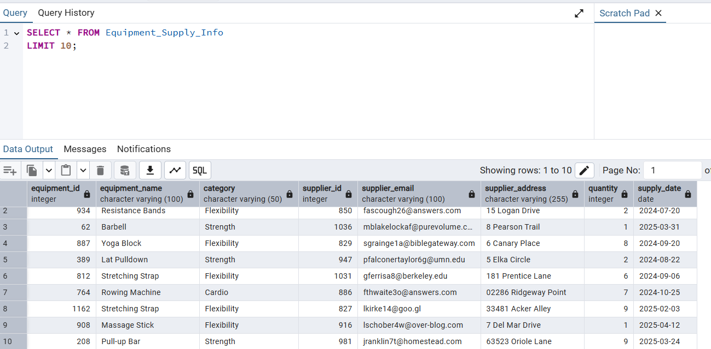

#### שאילתה 1: ציוד שסופק לאחר 1 בינואר 2025

```sql
SELECT *
FROM Equipment_Supply_Info
WHERE supply_date > '2025-01-01';
```
- 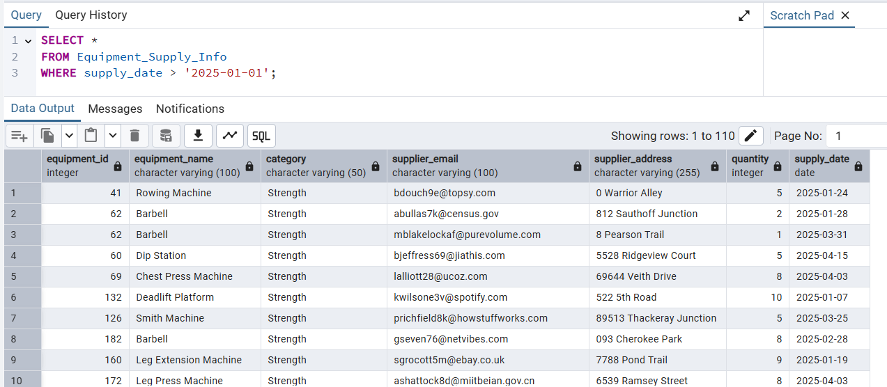

#### שאילתה 2: סיכום כמות הציוד שסופקה לפי ספק
```SELECT supplier_id, SUM(quantity) AS total_quantity
FROM Equipment_Supply_Info
GROUP BY supplier_id
ORDER BY total_quantity DESC;
```
- 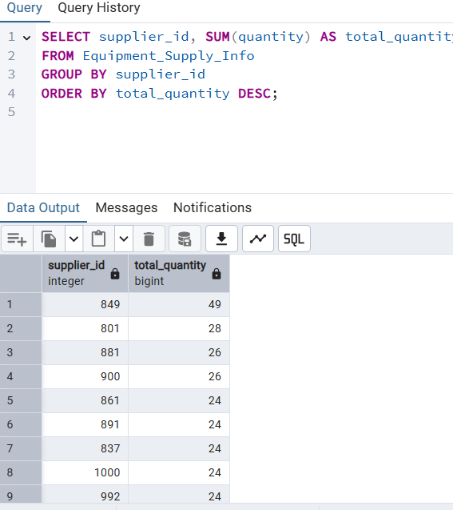

## שלב ד: תכנות

### פונקציות
#### פונקציה 1
הפונקציה מחפשת רשומות שבהן אדם שהה בחדר הכושר במשך זמן העולה על ערך סף שנקבע כפרמטר. לכל שהות שנמצאה, הפונקציה מחשבת את משך השהות בפועל (duration), ומסווגת את רמת הסיכון (riskLevel) לפי אורך השהות:
מעל 6 שעות – CRITICAL
מעל 3 שעות – WARNING
אחרת – OK  

בפונקציה נעשה שימוש באלמנטים הבאים:
Ref Cursor, שימוש ב־Cursor מפורש, טיפול ב־Exception, והסתעפות באמצעות IF ו־CASE.

```sql
-- Returns a cursor with details of visits longer than a specified duration threshold
CREATE OR REPLACE FUNCTION get_long_visits_cursor(duration_threshold INTERVAL)
RETURNS REFCURSOR AS $$
DECLARE
    ref REFCURSOR := 'ref';
BEGIN
    IF duration_threshold IS NULL THEN
        RAISE EXCEPTION 'Duration threshold cannot be null';
    END IF;

    OPEN ref FOR
    SELECT
        ER.personid,P.firstname,P.lastname,ER.entrytime,XR.exittime, XR.exittime - ER.entrytime AS duration,ER.gymid,
        CASE
            WHEN XR.exittime - ER.entrytime > INTERVAL '6 hours' THEN 'CRITICAL'
            WHEN XR.exittime - ER.entrytime > INTERVAL '3 hours' THEN 'WARNING'
            ELSE 'OK'
        END AS riskLevel
    FROM entryrecord ER
    NATURAL JOIN exitrecord XR
    NATURAL JOIN person P
    WHERE XR.exittime - ER.entrytime > duration_threshold
    ORDER BY duration DESC;

    RETURN ref;
END;
$$ LANGUAGE plpgsql;
```
מכיוון שהפונקציה מחזירה Ref Cursor, יש לבצע שתי פקודות להצגת התוצאה:
```sql
SELECT get_long_visits_cursor(INTERVAL '3 hours');
FETCH ALL FROM ref;
```
- 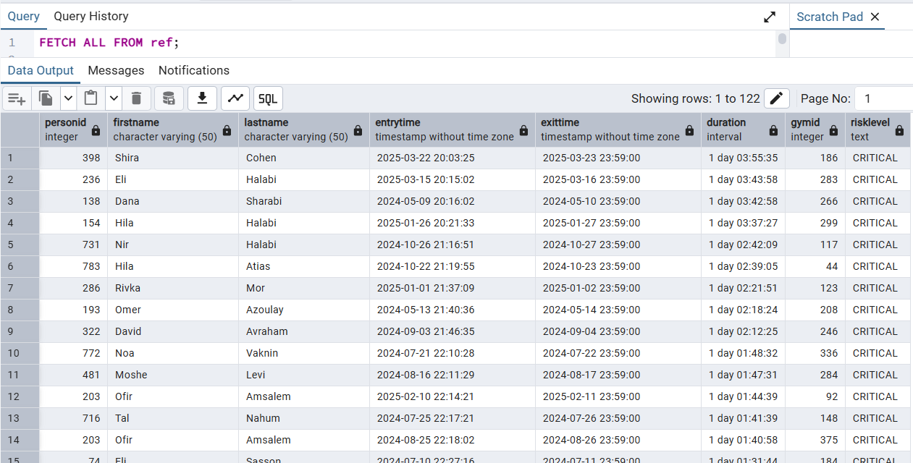

#### פונקציה 2
  הפונקציה מחשבת את סיכום השכר שיש לשלם לכל עובד שביצע עבודות מתוך טבלת job.
במקרים שבהם עלות העבודה (cost) לא צוינה (NULL), הפונקציה מעדכנת את הערך ל־60 שקלים.
לאחר מכן היא מחזירה לכל עובד את מספר העבודות שביצע ואת סך השכר הכולל.
אם אין כלל עבודות במערכת, תיזרק חריגה.
  
  בפונקציה נעשה שימוש באלמנטים הבאים:
פקודות DML לעדכון ערכי שכר חסרים, טיפול ב־Exception באמצעות RAISE EXCEPTION, והסתעפות עם תנאי IF.
בנוסף, הפונקציה מחזירה טבלה מלאה (Structured Table) שמייצגת רשומות עובדים עם סיכום עבודות ושכר.

```sql
-- Function to get a summary of employees' salaries
CREATE OR REPLACE FUNCTION get_employees_salary_summary()
RETURNS TABLE (
    personID INT,
    firstName VARCHAR(50),
    lastName VARCHAR(50),
    num_jobs BIGINT,
    total_salary NUMERIC
) AS $$
BEGIN
    -- raise an exception if there are no job records
    IF NOT EXISTS (SELECT 1 FROM job) THEN
        RAISE EXCEPTION 'No job records found in the system';
    END IF;

    -- update NULL salary values to 60 
    UPDATE job
    SET cost = 60
    WHERE cost IS NULL;

    -- return salary summary for each employee
    RETURN QUERY
    SELECT
        p.personID,
        p.firstName,
        p.lastName,
        COUNT(j.jobID) AS num_jobs,
        SUM(j.cost) AS total_salary
    FROM job j
    JOIN person p ON j.personID = p.personID
    GROUP BY p.personID, p.firstName, p.lastName
    ORDER BY total_salary DESC;
END;
$$ LANGUAGE plpgsql;
```
- 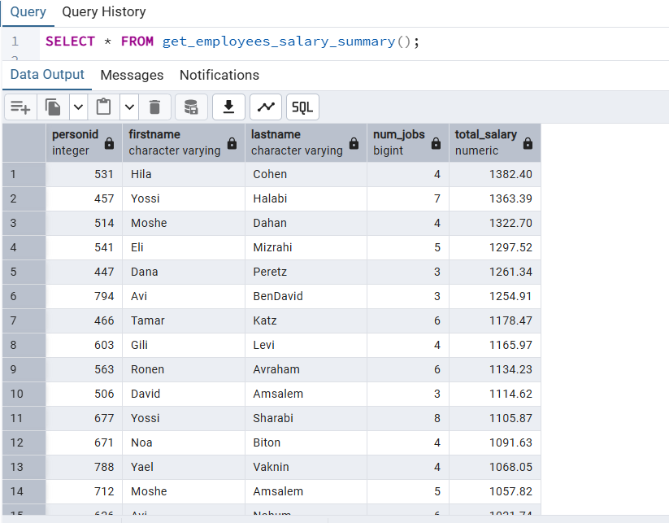
### פרוצדורות

#### פרוצדורה 1
הפרוצדורה מעדכנת את עלות העבודות (cost) עבור שירותים מסוג מסוים, לפי ערך שמוזן כפרמטר. אם תאריך העבודה בין ה־1 ל־15 בחודש, היא מוסיפה 50% לערך זה. במידה ואין עבודות מהסוג הנתון, נזרקת חריגה.
  
  האלמנטים בהם נעשה שימוש:
Exception, הסתעפות (IF, CASE)לולאה, (FOR)רקורד, (RECORD)פקודת, DML (UPDATE)

```sql
-- procedure to update job costs based on service type and date condition
CREATE OR REPLACE PROCEDURE update_jobs_cost_by_type(
    IN service_type_input TEXT,
    IN base_cost NUMERIC
)
LANGUAGE plpgsql
AS $$
DECLARE
    rec RECORD;
    updated_count INT := 0;
BEGIN
    -- check if there are any matching jobs
    IF NOT EXISTS (
        SELECT 1 FROM job WHERE servicetype = service_type_input
    ) THEN
        RAISE EXCEPTION 'No jobs found with service type: %', service_type_input;
    END IF;

    -- loop through each matching job and update cost conditionally
    FOR rec IN
        SELECT jobid, date
        FROM job
        WHERE servicetype = service_type_input
    LOOP
        IF EXTRACT(DAY FROM rec.date) BETWEEN 1 AND 15 THEN
            UPDATE job
            SET cost = base_cost * 1.5
            WHERE jobid = rec.jobid;
        ELSE
            UPDATE job
            SET cost = base_cost
            WHERE jobid = rec.jobid;
        END IF;

        updated_count := updated_count + 1;
    END LOOP;

    RAISE NOTICE 'Updated % jobs of type %', updated_count, service_type_input;
END;
$$;
```
לפני הפעלת הפרוצדורה:
- 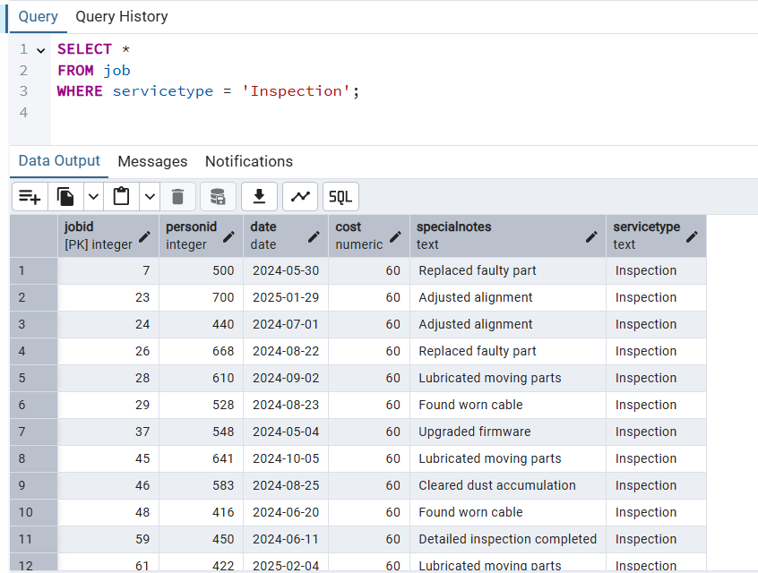

לאחר הפעלת הפרוצדורה:
```sql
CALL update_jobs_cost_by_type('Inspection', 100);
```
- 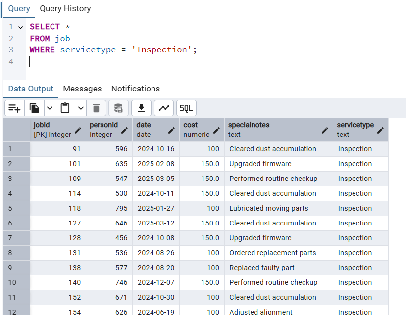


לפני הפרוצדורה השנייה נעדכן את בסיס הנתונים:
  נחליף את הערכים בטבלה member בשדה membershiptype לערכים ללא תלות בזמן
    
  קודם כל נמחק את האילוץ הקיים: 

```sql
    ALTER TABLE member
DROP CONSTRAINT member_membershiptype_check;
```

לאחר מכן עדכון כל הערכים לערכים ללא תלות בזמן:

```sql
UPDATE member SET membershipType = 'Standard'      WHERE membershipType = 'Monthly';
UPDATE member SET membershipType = 'Basic'         WHERE membershipType = 'Daily';
UPDATE member SET membershipType = 'Personalized'  WHERE membershipType = 'Personal Training';
UPDATE member SET membershipType = 'Visitor'       WHERE membershipType = 'Expired';
UPDATE member SET membershipType = 'Premium'       WHERE membershipType = 'Annual';
UPDATE member SET membershipType = 'Extended'      WHERE membershipType = 'Quarterly';
```
לאחר מכן ניצור אילוץ חדש:
```sql
ALTER TABLE member
ADD CONSTRAINT valid_membership_type
CHECK (
    membershipType IN (
        'Basic',
        'Standard',
        'Personalized',
        'Premium',
        'Extended',
        'Visitor'
    )
);
```
#### פרוצדורה 2
הפרוצדורה deactivate_old_members מקבלת מספר חודשים כפרמטר, ומאתרת את כל החברים בעלי סוג מנוי 'Basic' או 'Standard' שהצטרפו לפני יותר מהמספר הזה של חודשים, ועדיין פעילים. עבור כל אחד מהם, היא מעדכנת את הסטטוס שלו כלא-פעיל (isactive = false) ומציגה הודעה. אם לא נמצא אף חבר כזה, נזרקת שגיאה מתאימה.
  
  בפרוצדורה נעשה שימוש פקודת DML, הסתעפויות, לולאות, טיפול בשגיאות (Exception) ורשומות

  ```sql
-- This procedure deactivates members who have been active for more than a specified number of months.

CREATE OR REPLACE PROCEDURE deactivate_old_members(months_threshold INT)
LANGUAGE plpgsql
AS $$
DECLARE
    rec RECORD;
    updated_count INT := 0;
BEGIN
    -- validate input
    IF months_threshold <= 0 THEN
        RAISE EXCEPTION 'Invalid threshold: must be greater than 0. Given: %', months_threshold;
    END IF;

    -- loop over relevant members (joined with person to get names)
    FOR rec IN
    SELECT m.personid, p.firstname, p.lastname, m.memberstartdate
    FROM member m
    JOIN person p ON m.personid = p.personid
    WHERE m.membershiptype IN ('Basic', 'Standard')
      AND m.memberstartdate < CURRENT_DATE - make_interval(months := months_threshold)
      AND m.isactive = true

    LOOP
        UPDATE member
        SET isactive = false
        WHERE personid = rec.personid;

        updated_count := updated_count + 1;

        RAISE NOTICE 'Deactivated: % % (%), joined on %',
            rec.firstname, rec.lastname, rec.personid, rec.memberstartdate;
    END LOOP;

    -- if no members were updated, raise an exception
    IF updated_count = 0 THEN
        RAISE EXCEPTION 'No members found who meet the criteria for deactivation.';
    END IF;
END;
$$;
```
לפני הפעלת הפרוצדורה:
- 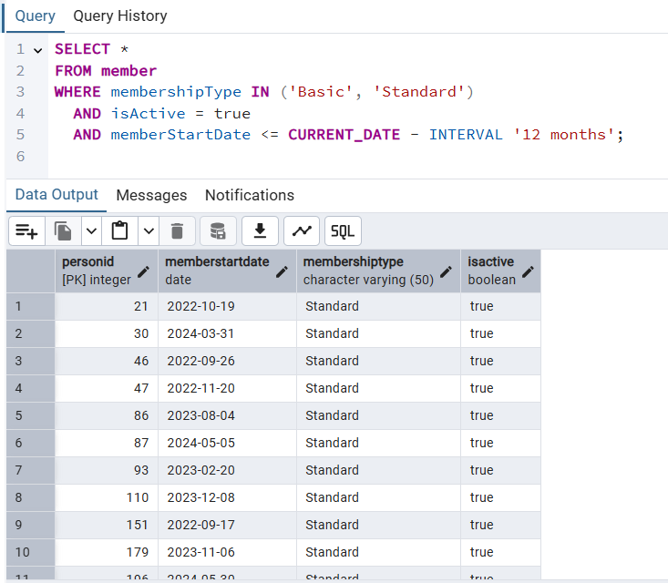

לאחר הפעלת הפרוצדורה:
```sql
CALL deactivate_old_members(12);
```
- 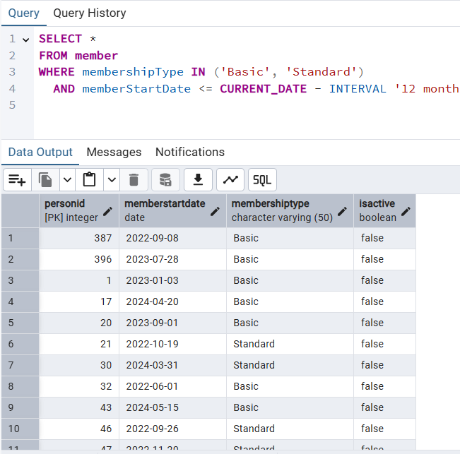

### טריגרים

#### טריגר 1
הטריגר בודק בעת הוספת כניסה לטבלה entryrecord אם המשתמש הוא חבר פעיל. אם לא – הפעולה נחסמת ונזרקת שגיאה מתאימה.
  
  האלמנטים שהשתמשנו בהם:
 הסתעפויות, Exception,  רשומות

  הפונקציה של הטריגר:
```sql
-- This script creates a trigger to validate that a person is an active member before inserting an entry record.
CREATE OR REPLACE FUNCTION validate_active_member()
RETURNS TRIGGER AS $$
DECLARE
    active_status BOOLEAN;
BEGIN
    -- Check if the person is an active member
    SELECT isactive INTO active_status
    FROM member
    WHERE personid = NEW.personid;

    -- If the member is not active (or not found), raise an error
    IF active_status IS DISTINCT FROM TRUE THEN
        RAISE EXCEPTION 'Entry denied: Person % is not an active member.', NEW.personid;
    END IF;

    RETURN NEW;
END;
$$ LANGUAGE plpgsql;
```
הפעלת הטריגר:
```sql
-- Create the trigger to call the function before inserting into entryrecord
CREATE TRIGGER trg_validate_entry_active_member
BEFORE INSERT ON entryrecord
FOR EACH ROW
EXECUTE FUNCTION validate_active_member();
```
- 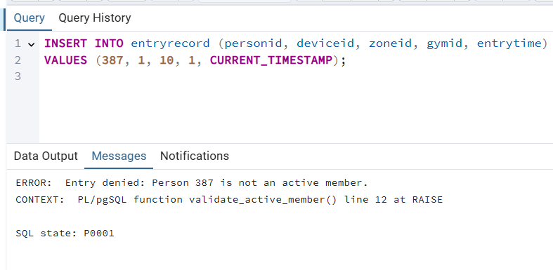


#### טריגר 2
הטריגר משלים אוטומטית את שדה nextServiceDate בטבלת maintenance לשישה חודשים אחרי תאריך השירות של העבודה (job.date), אם לא הוזן תאריך על ידי המשתמש.
  האלמנטים המיוחדים שהשתמשנו בהם:
 הסתעפויות,  Exception, רשומות

הפונקציה של הטריגר:
 ```sql
-- Function to set the next service date based on the job's service date
CREATE OR REPLACE FUNCTION set_next_service_date()
RETURNS TRIGGER AS $$
DECLARE
    job_service_date DATE;
BEGIN
    --run only when the column was omitted 
    IF NEW.nextServiceDate IS NULL THEN
        --fetch the service date from the related job record 
        SELECT date
        INTO   job_service_date
        FROM   job
        WHERE  jobid = NEW.jobid;

        --basic safety check
        IF job_service_date IS NULL THEN
            RAISE EXCEPTION
              'Cannot derive nextServiceDate: job % has no service date.',
              NEW.jobid;
        END IF;

        --add six months and assign 
        NEW.nextServiceDate :=
            (job_service_date + INTERVAL '6 months')::date;
    END IF;

    RETURN NEW;
END;
$$ LANGUAGE plpgsql;
```
הפעלת הטריגר:
 ```sql
-- Create the trigger to call the function before inserting or updating in maintenance
CREATE TRIGGER trg_set_next_service_date
BEFORE INSERT OR UPDATE ON maintenance
FOR EACH ROW
EXECUTE FUNCTION set_next_service_date();
``` 
- 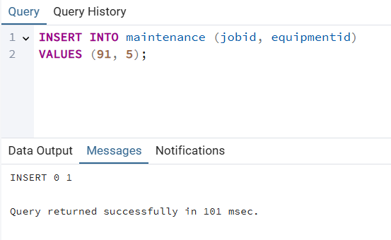
- 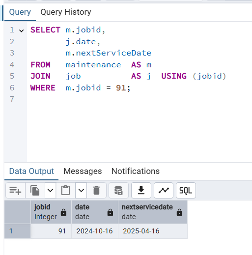
