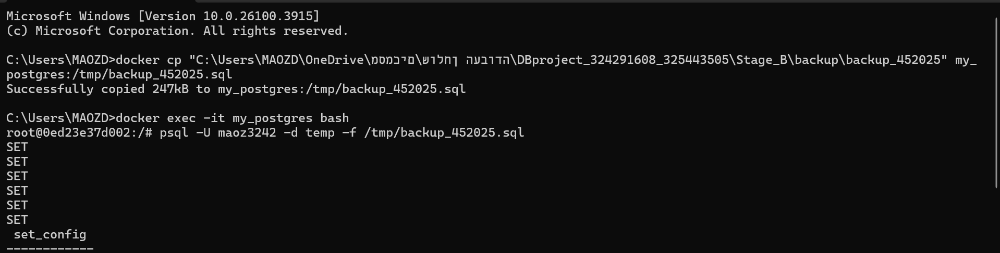
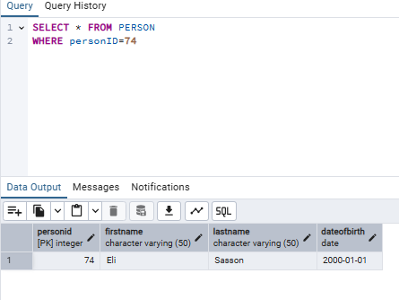

# רשת חדרי כושר
מערכת בקרת כניסות ויציאות

**מגישים:**

- מעוז דניאל, 324291608  
- אסף קלר, 325443505  

## תוכן עניינים

- [שלב א: עיצוב ובניית בסיס הנתונים](#שלב-א-עיצוב-ובניית-בסיס-הנתונים)
    - [הקדמה](#הקדמה)
    - [עיצוב בסיס הנתונים](#עיצוב-בסיס-הנתונים)
    - [יצירת בסיס הנתונים ואכלוסו](#יצירת-בסיס-הנתונים-ואכלוסו)
    - [גיבוי](#גיבוי)

## שלב-א-עיצוב-ובניית-בסיס-הנתונים

## הקדמה
בסיס הנתונים של בקרת כניסות ויציאות בחדרי הכושר נועד לנהל ביעילות מידע הקשור למנויים, עובדים, מכשירי גישה, תיקונים, אזורים ומכוני כושר. המערכת מבטיחה ארגון מסודר ומעקב אחר נתונים חיוניים כמו רישומי כניסה ויציאה, חברות מנויים, תחזוקת ציוד ופרטי עובדים.

### מטרת בסיס הנתונים
בסיס הנתונים משמש פתרון מסודר ואמין לניהול הפעילות ברשת חדרי כושר, ומטרתו:

- לנהל מעקב אחרי כניסות ויציאות של מנויים ועובדים מאזורים שונים במכוני הכושר.
- לעקוב אחרי מצב המכשירים השונים, לדווח ולנהל תיקונים ותחזוקה.
- לשמור על נתוני מנויים, כולל סוג חברות, תוקף החברות ופרטים אישיים.
- לנהל אזורי גישה שונים בתוך מכוני הכושר ולהגדיר הרשאות כניסה אליהם.
- לשמור מידע על עובדים, כולל פרטי התקשרות, תאריכי העסקה ותפקידים.

### מקרי שימוש אפשריים
- **מנהלי חדרי כושר** יכולים לעקוב ולנהל מידע על מנויים, מכשירים, אזורי גישה ועובדים.
- **מנויים** יכולים לקבל מידע מעודכן על סוג החברות שלהם, תוקף החברות ופרטי ביקורם בחדר הכושר.
- **עובדי תחזוקה** יכולים לקבל גישה לרשימות מכשירים שדורשים תיקון, לדווח על תיקונים שבוצעו, ולקבל מידע אודות המכשירים באחריותם.
- **הנהלה וצוות העובדים** יכולים להשתמש במערכת לניהול המידע, תכנון וארגון העבודה בצורה יעילה ומסודרת.

בסיס הנתונים בנוי בצורה שמייעלת את פעילות רשת חדרי הכושר, תוך שמירה על סדר, שקיפות ותקשורת נוחה בין כל הגורמים המעורבים.

---

## עיצוב בסיס הנתונים

### ERD

הסבר על התרשים:  קיימת לנו יישות בן-אדם, שממנו יורשות שתי ישויות: מנוי ועובד תחזוקה. כל עובד תחזוקה אחראי על אזור תיקון מסוים, ובנוסף יכול לתקן מכשיר גישה. עבור כל אדם שנכנס לאזור מסוים בחדר הכושר יש רשומת כניסה ורשומת יציאה. כל רשומת כניסה ויציאה היא ישות חלשה שתלויה באדם ובמכשיר גישה.  כל מכשיר גישה הוא ישות חלשה שתלויה באזור, וכל אזור הוא ישות חלשה שתלויה בחדר כושר מסוים
### DSD

## יצירת בסיס הנתונים ואכלוסו

### יצירת בסיס הנתונים
- קובץ יצירת הטבלאות: [createTables.sql](Stage_A/scripts/createTables.sql)
- קובץ הכנסה לטבלאות: [insertTables.sql](Stage_A/scripts/insertTables.sql)
- קובץ מחיקת הטבלאות: [dropTables.sql](Stage_A/scripts/dropTables.sql)
- קובץ בחירת כל הטבלאות: [selectAll.sql](Stage_A/scripts/selectAll.sql)
  
### אכלוס הנתונים
אכלסנו את הנתונים ב־3 דרכים:

**1. Mockaroo**  
יצרנו את הנתונים בצורה רנדומלית באתר עבור הסכמה של חדר כושר והעלנו את הקובץ ישירות  

[📄 הורדת קובץ ה־CSV – gym_400.csv](Stage_A/data/mockaroo/gym_400.csv)

**2. הכנסת נתונים מקבצים**  
כתבנו קוד בפייתון שיוצר דאטה עבור הסכמות של אזורים, מכשירי גישה ותיקון, כך שהסכמה של מכשירי הגישה נבנת על נתונים מהסכמה של אזורים (מכיוון שהמפתח של אזור הוא מפתח זר למכשיר גישה). העברנו את הנתונים לקובץ CSV, ואותו העלינו ישירות ל־Postgres.  
- [קובץ CSV של מכשירי גישה (accessDevice)](Stage_A/data/csv/accessDevice/accessDevice.csv)
- [קובץ CSV של תיקונים (repair)](Stage_A/data/csv/repair/repair.csv)
- [קובץ CSV של אזורים (zone)](Stage_A/data/csv/zone/zone.csv)

בנוסף, הכנסנו בצורה ידנית את פקודות ה־INSERT עבור מנויים, אנשים ועובדי תחזוקה.  
#### 🔗 קישורים לקבצים:
- [insert_member_400_from_800 (1).sql](Stage_A/data/insert%20commands/insert_member_400_from_800%20%281%29.sql)
- [insert_person_800.sql](Stage_A/data/insert%20commands/insert_person_800.sql)
- [insert_worker_400_from_800.sql](Stage_A/data/insert%20commands/insert_worker_400_from_800.sql)

**3. יצירת סקריפט בפייתון**  
יצרנו נתונים בעזרת סקריפט פייתון עבור רשומות הכניסה והיציאה, שמסתמך על נתונים ממכשירי גישה ואנשים (מכיוון שהמפתחות שלהם הם מפתחות זרים לרשומות). אותם העברנו לתוך קובץ CSV והעלינו אותם ישירות ל־Postgres מתוך הסקריפט.  
##### 🟢 רשומות כניסה (Entry Records)

- [entryRecord.csv](Stage_A/data/python%20scripts/entry_record/entryRecord.csv)  
- [insert_entry_record.py](Stage_A/data/python%20scripts/entry_record/insert_entry_record.py)

##### 🔴 רשומות יציאה (Exit Records)

- [exitRecord.csv](Stage_A/data/python%20scripts/exit_record/exitRecord.csv)  
- [insert_exit_record.py](Stage_A/data/python%20scripts/exit_record/insert_exit_record.py)
  
הערה: מכיוון שבבסיס הנתונים שלנו ישויות נבנות אחת על השנייה, יצרנו קודם כל את הנתונים של gym, שלא תלוי באף אחד, לאחר מכן של person, worker ו-member, ולאחר מכן את של zone, accessdevice, entry/exit record. גם את הנתונים עצמם ביססנו מישות חזקה ליישות החלשה שנתמכת בה, כך שהערכים בבסיס הנתונים יהיו הגיוניים ותואמים לעולם האמיתי
## גיבוי
קובץ הגיבוי נשמר עם תאריך הגיבוי 

  
[ הורדת קובץ הגיבוי (backup1_642025)](Stage_A/backup/backup1_642025)

---

##### 🔁 פעולת שחזור:

## שלב ב: שאילתות

בשלב זה ביצענו שאילתות שונות על בסיס הנתונים שבנינו בשלב א'. המטרה הייתה להוציא נתונים משמעותיים לצורכי ניתוח, תחזוקה וניהול חכם של רשת חדרי הכושר.

---

### שאילתות לדוגמה: שאילתות SELECT

להלן מספר שאילתות שבוצעו, יחד עם תיאור מטרתן, הקובץ שבו הן כתובות, ותמונה שמציגה את הפלט או את התוצאה הוויזואלית של שאילתא.

---

####  שאילתה 1: סיכום כמות כניסות ואזורים לפי חדר כושר

-  קובץ השאילתא: [query_1.sql](Stage_B/Queries/query_1/query_1.sql)  
- תוצאת השאילתא:  
  

**מה השאילתא מחזירה:**  
את מזהה חדר הכושר, שמו, העיר שבה הוא נמצא, מספר הכניסות הכולל שנרשמו אליו, ומספר האזורים הקיימים בו – רק עבור חדרי כושר עם יותר משלושה אזורים, וממויין לפי כמות הכניסות בסדר יורד.

**המטרה:**  
לאפשר השוואה בין חדרי כושר שונים מבחינת עומס משתמשים מול מבנה פנימי, לצורך תובנות ניהוליות ושיפור תשתיות.

---

####  שאילתא 2: חברים פעילים שלא נכנסו מאז תאריך מסוים

-  קובץ השאילתא: [query_2.sql](Stage_B/Queries/query_2/query_2.sql)  
-  תוצאת השאילתא:  
  

**מה השאילתא מחזירה:**  
את שם הפרטי, שם המשפחה, תאריך הלידה וסוג החברות של כל המנויים הפעילים, אשר לא נכנסו לאף חדר כושר מאז ה־3 בינואר 2025

**הרעיון :**  
לזהות מנויים פעילים שלא ביקרו בחדר כושר מאז תאריך מסוים, לצורך מעקב או פנייה יזומה מצד ההנהלה.

---

####  שאילתא 3: סיכום כניסות לפי חדר כושר ולפי חודש (בשנת 2025)

-  קובץ השאילתא: [query_3.sql](Stage_B/Queries/query_3/query_3.sql)  
-  תוצאת השאילתא:  
  

**מה השאילתא מחזירה:**  
את מזהה חדר הכושר, שמו, העיר שבה הוא נמצא, השנה והחודש של הכניסה, וכמות הכניסות באותו חודש – עבור כל חודש בשנת 2025. התוצאות מקובצות לפי חדר כושר וחודש, וממוינות לפי מזהה חדש הכושר והשנה-חודש.

**הרעיון :**  
לבחון את כמות הביקורים בכל חדר כושר לאורך חודשי השנה לצורך מעקב עונתי וניתוח מגמות.

---

####  שאילתא 4: זמן שהייה ממוצע לפי אזור בחדר כושר מס' 184

-  קובץ השאילתא: [query_4.sql](Stage_B/Queries/query_4/query_4.sql)  
-  תוצאת השאילתא:  
  

**מה השאילתא מחזירה:**  
את מזהה האזור, סוג האזור, וזמן השהייה הממוצע בו  בחדר כושר מספר 184. התוצאה ממוינת מהאזור בו שוהים הכי הרבה ועד לפחות.

**הרעיון :**  
לזהות אילו אזורים בחדר הכושר מושכים מתאמנים לזמן ארוך יותר, לצורך תכנון תפעולי נכון או תגבור ציוד.

---

####  שאילתא 5: חדרי כושר עם יותר מ־5 תיקונים

-  קובץ השאילתא: [query_5.sql](Stage_B/Queries/query_5/query_5.sql)  
-  תוצאת השאילתא:  
  

**מה השאילתא מחזירה:**  
את שם חדר הכושר, העיר שבה הוא נמצא, ומספר התיקונים שבוצעו בו – רק עבור חדרי כושר שבהם בוצעו יותר מ־5 תיקונים. התוצאה ממוינת מהחדר עם הכי הרבה תיקונים לפחות.

**הרעיון :**  
לאתר חדרי כושר עם עומס תחזוקתי גבוה לצורך בדיקה, טיפול מונע או תגבור צוותי תחזוקה.

---

####  שאילתא 6: חדרי כושר עם לפחות 2 אזורים לא נגישים ויותר מ־2 כניסות

-  קובץ השאילתא: [query_6.sql](Stage_B/Queries/query_6/query_6.sql)  
-  תוצאת השאילתא:  
  

**מה השאילתא מחזירה:**  
את מזהה חדר הכושר, שמו והעיר שבה הוא נמצא – רק  עבור חדרי כושר שבהם קיימים לפחות שני אזורים לא נגישים וגם נרשמו יותר מ2 כניסות

**הרעיון :**  
לאתר חדרי כושר שמצד אחד פעילים, אך מצד שני כוללים אזורים לא נגישים – כדי לשקול תיקונים או פתיחה מחודשת של אזורים.

---

####  שאילתא 7: כניסות ויציאות מאזורים עמוסים במיוחד

-  קובץ השאילתא: [query_7.sql](Stage_B/Queries/query_7/query_7.sql)  
-  תוצאת השאילתא:  
  

**מה השאילתא מחזירה:**  
את שם חדר הכושר, העיר, סוג האזור, שם פרטי ושם משפחה של האדם, זמן הכניסה וזמן היציאה – עבור אזורים שבהם נרשמו יותר מ־80 כניסות בסך הכול.

**הרעיון שלה:**  
להציג פעילות מפורטת של אנשים באזורים בעלי עומס גבוה במיוחד, לצורך ניתוח עומסים או תכנון תשתיות עתידי.

---

####  שאילתא 8: סוגי מכשירים עם פחות יציאות מהממוצע

-  קובץ השאילתא: [query_8.sql](Stage_B/Queries/query_8/query_8.sql)  
-  תוצאת השאילתא:  
  

**מה השאילתא מחזירה:**  
את סוג המכשיר ומספר היציאות שבוצעו דרכו – רק עבור סוגי מכשירים שבהם מספר היציאות קטן מהממוצע הכללי בין כל סוגי המכשירים.

**הרעיון שלה:**  
לאתר מכשירי גישה פחות פעילים מהממוצע, לצורך בדיקה תפעולית או הסרה עתידית של ציוד לא נחוץ.

---

## שאילתות עדכון

בקטע זה נציג שאילתות מסוג UPDATE שבוצעו על בסיס הנתונים, יחד עם הסבר, צילום לפני השינוי, צילום ההרצה, וצילום מצב הנתונים לאחר השינוי.

---

####  שאילתא 1: עדכון סוג החברות למנויים פעילים במיוחד

-  קובץ השאילתא: [update_1.sql](Stage_B/Updates/update_1/update_1.sql)  
-  צילום לפני העדכון:  
  
-  צילום הרצת העדכון:  
  
-  צילום לאחר העדכון:  
  

**מה השאילתא עושה:**  
מעדכנת את סוג החברות של מנויים שמוגדרים כ־"Monthly" ל־"Quarterly", רק אם הם נכנסו לחדרי כושר יותר מהממוצע הכללי של מספר הכניסות.

**הרעיון שלה:**  
לשדרג אוטומטית את סוג החברות למשתמשים פעילים במיוחד – כהוקרה, שיפור שירות או תמריץ.

####  שאילתא 2: סימון מנויים לא פעילים שלא נכנסו מעולם כ־'Expired'

-  קובץ השאילתא: [update_2.sql](Stage_B/Updates/update_2/update_2.sql)  
-  צילום לפני העדכון:  
  
-  צילום הרצת העדכון:  
  
-  צילום לאחר העדכון:  
  

**מה השאילתא עושה:**  
מעדכנת את סוג החברות של כל המנויים שאינם פעילים (`isActive = FALSE`) ושמעולם לא נכנסו לחדר כושר (כלומר, אין להם רשומת כניסה) – ל־'Expired'.

**הרעיון שלה:**  
לסמן מנויים ישנים ולא פעילים ככאלה שתוקף המנוי שלהם פג, לצורך ניקוי מידע ותחזוקת נתונים.

---

####  שאילתא 3: השבתת מנויים שלא הגיעו לאחרונה

-  קובץ השאילתא: [update_3.sql](Stage_B/Updates/update_3/update_3.sql)  
-  צילום לפני העדכון:  
  
-  צילום הרצת העדכון:  
  
-  צילום לאחר העדכון:  
  

**מה השאילתא עושה:**  
מעדכנת את שדה `isActive` ל־FALSE עבור מנויים שביצעו לפחות 3 כניסות, אך הפעם האחרונה שבה נכנסו הייתה לפני יותר משלושה חודשים.

**הרעיון שלה:**  
להשבית מנויים שהיו פעילים בעבר אך לא הגיעו זמן רב, לצורך ניהול מדויק של סטטוס החברות.

---

## שאילתות מחיקה

בקטע זה מוצגות שאילתות מחיקה (`DELETE`) שבוצעו על בסיס הנתונים, כולל הסבר ברור, צילום מצב לפני המחיקה, צילום ההרצה, וצילום לאחר המחיקה — להמחשת השינוי בפועל.

---

####  שאילתא 1: מחיקת חדרי כושר קטנים בערים מסוימות

-  קובץ השאילתא: [delete_1.sql](Stage_B/Delete/delete_1/delete_1.sql)  
-  צילום לפני המחיקה:  
  
-  צילום הרצת המחיקה:  
  
-  צילום לאחר המחיקה:  
  

**מה השאילתא עושה:**  
מוחקת חדרי כושר שנמצאים בעכו או פתח תקווה, שיש להם פחות מ־2 אזורים, **ובלבד שיש להם לפחות אזור נגיש אחד** (`isAccessible = TRUE`).

**הרעיון שלה:**  
לנקות מהרשת חדרי כושר קטנים עם פעילות חלקית בלבד, במטרה לשמר רק סניפים מרכזיים ופעילים.

---

####  שאילתא 2: מחיקת מנויים צעירים שאינם פעילים ולא נכנסו מעולם

-  קובץ השאילתא: [delete_2.sql](Stage_B/Delete/delete_2/delete_2.sql)  
-  צילום לפני המחיקה:  
  
-  צילום הרצת המחיקה:  
  
-  צילום לאחר המחיקה:  
  

**מה השאילתא עושה:**  
מוחקת מנויים לא פעילים (`isActive = FALSE`) שמעולם לא נכנסו לחדר כושר (כלומר אין להם רשומות כניסה), ושנולדו לאחר 1 בינואר 2000.

**הרעיון שלה:**  
לצמצם את בסיס הנתונים ממנויים צעירים שלא התחילו להשתמש בשירות, כחלק מתחזוקת מידע וניקוי משתמשים.

####  שאילתא 3: מחיקת תיקונים ישנים מסוג Replacement

-  קובץ השאילתא: [delete_3.sql](Stage_B/Delete/delete_3/delete_3.sql)  
-  צילום לפני המחיקה:  
  
-  צילום הרצת המחיקה:  
  
-  צילום לאחר המחיקה:  
  

**מה השאילתא עושה:**  
מוחקת רשומות תיקון מהטבלה `repair` שבוצעו לפני יותר משנה, ושסוג השירות (`serviceType`) שלהן מכיל את המילה "replacement".

**הרעיון שלה:**  
לנקות תיקונים ישנים הקשורים להחלפות, כחלק מתחזוקת מערכת שוטפת והפחתת עומס על נתוני עבר.

##  אילוצים (Constraints)

בשלב זה הוספנו מספר אילוצים לשלוש טבלאות במערכת, באמצעות הפקודה `ALTER TABLE`.  
לאחר כל הוספה ניסינו להכניס נתונים שסותרים את האילוץ, כדי לוודא שהמערכת חוסמת את הפעולה כנדרש.

###  אילוץ 1: אימות שדה `contactInfo` בטבלת `maintenanceWorker`
האילוץ מוודא שערך השדה `contactInfo` הוא כתובת מייל חוקית או מספר טלפון חוקי בפורמט בינלאומי.  
אם הערך אינו תואם לאחד מהפורמטים הללו, ההכנסה תיחסם.

**תיאור שגיאה:**  
לאחר הוספת האילוץ, ניסינו להזין ערך שאינו כתובת מייל תקינה ואינו מספר טלפון חוקי (לדוגמה: מחרוזת בעברית).  
המערכת חסמה את ההכנסה וזרקה שגיאת `CHECK CONSTRAINT` כפי שצפוי.

-  צילום לנסיון הכנסה:  
  

###  אילוץ 2: אימות ערכים חוקיים בשדות `membershipType` ו־`entryTime`
האילוץ הראשון בודק שהשדה `membershipType` כולל רק אחד מהערכים המותרים ('Monthly', 'Annual' וכו').  
האילוץ השני מוודא שערך השדה `entryTime` לא יהיה תאריך עתידי.

**תיאור שגיאה:**  
לאחר הוספת האילוצים, ניסינו להזין ערכים לא חוקיים – כגון `membershipType` שלא קיים ברשימת הסוגים המותרים , או `entryTime`  
המערכת חסמה את ההכנסות וזרקה שגיאת `CHECK CONSTRAINT`.

-  צילום לנסיון הכנסה:  
  

### אילוץ 3: הגבלת ערך שדה `dateOfBirth` בטבלת `person` לתאריכים שאינם בעתיד
האילוץ מונע הזנת ערך בשדה `dateOfBirth` שהוא תאריך מאוחר מהתאריך הנוכחי (`CURRENT_DATE`).

**תיאור שגיאה:**  
לאחר הוספת האילוץ, ניסינו להזין ערך לשדה `dateOfBirth` בטבלת `person` שהוא תאריך מהעתיד.  
המערכת זיהתה שהערך אינו עומד בתנאי האילוץ וזרקה שגיאת `CHECK CONSTRAINT`.

-  צילום לנסיון הכנסה:  
  

## COMMIT – שמירת שינויים בבסיס הנתונים
להלן הדגמה של תהליך ביצוע עדכון ושמירתו:

- הצגת הנתון המקורי:
   

-  על רשומה מסוימת בטבלת `person`:
   

- הצגת נתונים לאחר ה־UPDATE ולפני ה־COMMIT (עדיין ניתן לבטל):
   

- הרצת פקודת `COMMIT` – שמירת השינוי באופן קבוע:
   

- מצב בסיס הנתונים לאחר ה־COMMIT – השינוי נשמר ואינו ניתן לביטול:
   
